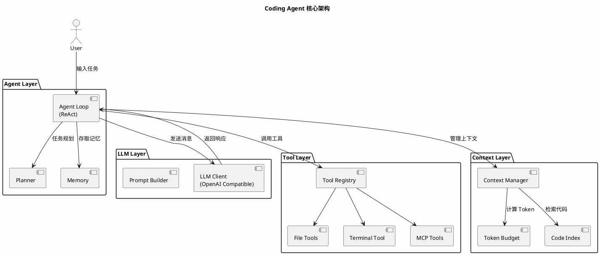
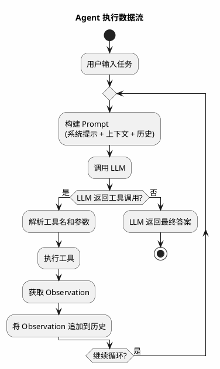
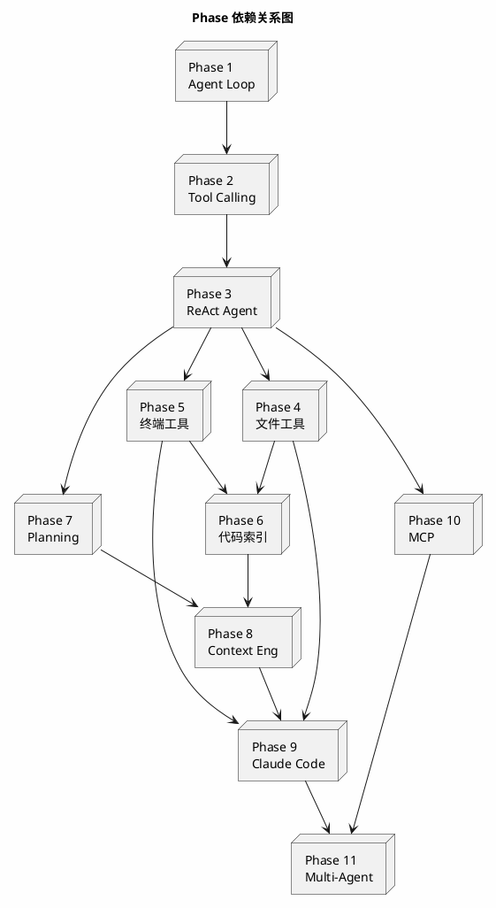

# Coding Agent 从零构建 — 总体架构概览

## 项目愿景

构建一个类似 Claude Code 的 Coding Agent，具备代码理解、文件编辑、终端执行、自动修复等能力。

## 架构演进路线

```plantuml
@startuml
skinparam backgroundColor #FEFEFE
skinparam defaultFontSize 14
skinparam packageStyle rectangle

title Coding Agent 架构演进路线

rectangle "Phase 1: 最简 Agent Loop" as p1 {
    component "User" as p1u
    component "LLM" as p1l
    component "Answer" as p1a
    p1u --> p1l --> p1a
}

rectangle "Phase 2: Tool Calling" as p2 {
    component "User" as p2u
    component "LLM" as p2l
    component "Tool" as p2t
    component "Observation" as p2o
    p2u --> p2l
    p2l --> p2t
    p2t --> p2o
    p2o --> p2l
}

rectangle "Phase 3: ReAct Agent" as p3 {
    component "Thought" as p3t
    component "Action" as p3a
    component "Observation" as p3o
    p3t --> p3a --> p3o
    note right of p3o : 循环执行直到得出结论
}

rectangle "Phase 4-5: 工具层" as p45 {
    component "文件系统工具" as fs
    component "终端工具" as term
}

rectangle "Phase 6: 代码库索引" as p6 {
    component "文件树" as tree
    component "Chunk" as chunk
    component "Embedding" as emb
    component "检索" as retriever
}

rectangle "Phase 7: Planning" as p7 {
    component "Task" as p7t
    component "SubTask" as p7s
    component "Execute" as p7e
    p7t --> p7s --> p7e
}

rectangle "Phase 8: Context Engineering" as p8 {
    component "Token Budget" as p8a
    component "File Context" as p8b
    component "Conversation Context" as p8c
    component "Working Memory" as p8d
}

rectangle "Phase 9: Claude Code 风格" as p9 {
    component "自动读文件" as p9a
    component "自动修改文件" as p9b
    component "自动执行命令" as p9c
    component "自动分析错误" as p9d
    component "自动重试" as p9e
}

rectangle "Phase 10: MCP Client" as p10 {
    component "MCP Protocol" as p10m
    component "外部工具" as p10e
    p10m --> p10e
}

rectangle "Phase 11: Multi-Agent" as p11 {
    component "Planner Agent" as p11a
    component "Executor Agent" as p11b
    component "Reviewer Agent" as p11c
}

p1 -down-> p2
p2 -down-> p3
p3 -down-> p45
p45 -down-> p6
p6 -down-> p7
p7 -down-> p8
p8 -down-> p9
p9 -down-> p10
p10 -down-> p11

@enduml
```

## 目标项目结构

```
my-claude-code/
├── docs/                          # 设计文档
│   ├── 00-overview.md
│   ├── phase-01-agent-loop.md
│   ├── phase-02-tool-calling.md
│   ├── phase-03-react-agent.md
│   ├── phase-04-file-tools.md
│   ├── phase-05-terminal-tool.md
│   ├── phase-06-codebase-index.md
│   ├── phase-07-planning.md
│   ├── phase-08-context-engineering.md
│   ├── phase-09-claude-code-style.md
│   ├── phase-10-mcp-client.md
│   └── phase-11-multi-agent.md
├── src/
│   ├── agent/                     # Agent 核心
│   │   ├── __init__.py
│   │   ├── base.py               # Agent 基类
│   │   ├── react.py              # ReAct Agent
│   │   └── planner.py            # Planning Agent
│   ├── tools/                     # 工具层
│   │   ├── __init__.py
│   │   ├── base.py               # Tool 基类
│   │   ├── file_tools.py         # 文件系统工具
│   │   ├── terminal.py           # 终端工具
│   │   └── mcp_tools.py          # MCP 工具
│   ├── context/                   # 上下文管理
│   │   ├── __init__.py
│   │   ├── manager.py            # 上下文管理器
│   │   ├── budget.py             # Token 预算
│   │   └── memory.py             # 工作记忆
│   ├── index/                     # 代码库索引
│   │   ├── __init__.py
│   │   ├── file_tree.py          # 文件树
│   │   ├── chunker.py            # 代码分块
│   │   ├── embedder.py           # 向量嵌入
│   │   └── retriever.py          # 检索器
│   ├── llm/                       # LLM 接口
│   │   ├── __init__.py
│   │   ├── base.py               # LLM 基类
│   │   └── openai_compat.py      # OpenAI 兼容接口
│   └── mcp/                       # MCP 协议
│       ├── __init__.py
│       ├── client.py             # MCP Client
│       └── protocol.py           # MCP 协议定义
├── tests/                         # 测试
├── main.py                        # 入口
├── pyproject.toml
└── .gitignore
```

## 核心架构图



## 数据流



## 技术选型

| 层次 | 技术 | 理由 |
|------|------|------|
| 语言 | Python 3.11+ | AI 生态最成熟，LLM SDK 支持最好 |
| LLM 接口 | OpenAI Compatible API | 兼容 OpenAI / Azure / 本地模型 |
| 向量数据库 | SQLite + 自建索引 | 轻量，无需外部依赖 |
| 终端执行 | subprocess + asyncio | Python 原生，支持流式输出 |
| MCP | JSON-RPC over stdio | MCP 协议标准 |
| 测试 | pytest | Python 标准测试框架 |

## 各阶段依赖关系



## 关键设计原则

1. **渐进式构建** — 每个 Phase 都可独立运行和测试
2. **接口抽象** — LLM、Tool、Context 均通过抽象接口交互，便于替换实现
3. **可观测性** — 每一步都有日志，方便调试 Agent 行为
4. **Token 意识** — 从 Phase 8 开始严格管理 Token 预算
5. **安全优先** — 终端执行需要确认，文件修改可回滚