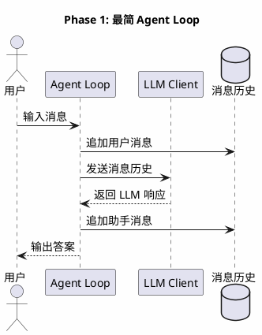
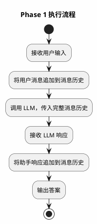
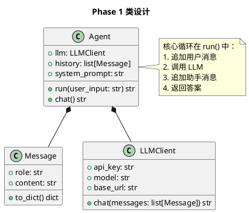

# Phase 1: 最简 Agent Loop

## 设计目标

实现一个最简单的 Agent 循环：用户输入 → LLM 推理 → 返回答案。

这是整个系统的基石。理解这个循环，才能理解后续所有复杂能力的本质——**一切 Agent 都是"调用 LLM → 处理响应 → 决定下一步"的循环**。

## 为什么这样设计

### Agent 的本质是什么？

Agent 不是魔法，它的本质是一个 **while 循环**：

```python
while not done:
    response = llm.chat(messages)
    done = process(response)
```

Claude Code、Cursor Agent、Aider，无一例外。区别只在于：
- 循环内部做了什么
- 什么时候终止
- 如何构建发送给 LLM 的消息

### 为什么从最简循环开始？

很多框架（LangChain、CrewAI）把 Agent Loop 封装得很深，让你觉得 Agent 是个黑盒。从最简循环开始，你能看到：

1. **Agent 就是个循环** — 没有神秘之处
2. **消息历史是核心数据结构** — 所有上下文都通过它传递
3. **LLM 是无状态的** — 每次调用都是独立的，状态靠消息历史维护
4. **循环控制是关键** — 何时停止、何时继续，决定了 Agent 的行为

### 各产品如何实现这个循环？

| 产品 | 循环实现 | 特点 |
|------|---------|------|
| Claude Code | 单循环 + 工具调用 | 每轮检测是否包含工具调用，有则执行后继续 |
| Cursor Agent | 多轮对话 + 编辑指令 | LLM 输出结构化编辑指令，Agent 执行后继续 |
| Aider | 单循环 + 编辑块 | LLM 输出 SEARCH/REPLACE 块，Agent 解析执行 |
| OpenCode | ReAct 循环 | Thought → Action → Observation 循环 |

## 架构图



## 流程图



## 类图



## 目录结构

```
src/
├── agent/
│   ├── __init__.py
│   └── base.py          # Agent 基类 + 最简循环
├── llm/
│   ├── __init__.py
│   └── base.py          # LLM 客户端
└── main.py              # 入口
```

## 核心代码

### Message — 消息数据结构

```python
# src/llm/read.py
from dataclasses import dataclass


@dataclass
class Message:
    role: str      # "system" | "user" | "assistant"
    content: str

    def to_dict(self) -> dict:
        return {"role": self.role, "content": self.content}
```

**设计要点**：
- `role` 遵循 OpenAI Chat Completion 的角色定义
- `to_dict()` 方便序列化发送给 API
- 使用 `dataclass` 而非 Pydantic，保持最小依赖

### LLMClient — LLM 客户端

```python
# src/llm/read.py (续)
import os
from openai import OpenAI


class LLMClient:
    def __init__(
        self,
        model: str = "gpt-4o",
        api_key: str | None = None,
        base_url: str | None = None,
    ):
        self.model = model
        self.client = OpenAI(
            api_key=api_key or os.getenv("OPENAI_API_KEY"),
            base_url=base_url or os.getenv("OPENAI_BASE_URL"),
        )

    def chat(self, messages: list[Message]) -> str:
        response = self.client.chat.completions.create(
            model=self.model,
            messages=[m.to_dict() for m in messages],
        )
        return response.choices[0].message.content
```

**设计要点**：
- 使用 OpenAI SDK，兼容所有 OpenAI Compatible API
- `base_url` 可配置，支持本地模型（Ollama、vLLM 等）
- 只暴露 `chat()` 方法，返回纯文本——这是最简接口

### Agent — 最简 Agent

```python
# src/agent/read.py
from llm.base import LLMClient, Message


class Agent:
    def __init__(self, llm: LLMClient, system_prompt: str = "你是一个有用的助手。"):
        self.llm = llm
        self.system_prompt = system_prompt
        self.history: list[Message] = []

    def run(self, user_input: str) -> str:
        # 1. 追加用户消息
        self.history.append(Message(role="user", content=user_input))

        # 2. 构建完整消息列表（系统提示 + 历史）
        messages = [Message(role="system", content=self.system_prompt)]
        messages.extend(self.history)

        # 3. 调用 LLM
        response = self.llm.chat(messages)

        # 4. 追加助手消息到历史
        self.history.append(Message(role="assistant", content=response))

        # 5. 返回答案
        return response
```

**设计要点**：
- `system_prompt` 每次都发送，但不存入 history——这是常见的上下文管理策略
- `history` 只存 user/assistant 消息，避免系统提示重复
- `run()` 是同步的，后续 Phase 会改为异步

### main.py — 入口

```python
# main.py
from agent.base import Agent
from llm.base import LLMClient


def main():
    llm = LLMClient()
    agent = Agent(llm=llm)

    print("Coding Agent v0.1 — Phase 1")
    print("输入 'quit' 退出\n")

    while True:
        user_input = input("你: ").strip()
        if user_input.lower() == "quit":
            break
        if not user_input:
            continue

        response = agent.run(user_input)
        print(f"\n助手: {response}\n")


if __name__ == "__main__":
    main()
```

## 当前方案的问题

| 问题 | 说明 |
|------|------|
| **无法使用工具** | LLM 只能"说话"，不能"做事"——无法读文件、执行命令 |
| **无法多步推理** | 一次对话只有一轮 LLM 调用，无法迭代解决复杂问题 |
| **无上下文管理** | 历史无限增长，最终超出 Token 限制 |
| **无错误处理** | API 调用失败、超时等场景未处理 |
| **同步阻塞** | `run()` 是同步的，无法流式输出 |

### Claude Code 如何解决？

Claude Code 的核心循环是：**每次 LLM 调用后，检查响应中是否包含工具调用（tool_use）。如果有，执行工具，将结果追加到消息历史，再次调用 LLM。如果没有，返回最终答案。**

这就是 Phase 2 要实现的 Tool Calling。

### Cursor 如何解决？

Cursor 的 Agent 模式类似，但工具是"编辑指令"——LLM 输出结构化的文件编辑命令（类似 diff），Agent 解析并应用。循环继续直到 LLM 不再输出编辑指令。

### 工业界最佳实践

1. **Tool Calling 是 Agent 的核心能力** — 没有 Tool Calling，Agent 只是个聊天机器人
2. **OpenAI Function Calling 是事实标准** — 所有主流 LLM 都支持
3. **流式输出提升体验** — 用户不想等 30 秒才看到答案

## 练习题

1. **基础**：运行代码，确认能正常对话。尝试修改 `system_prompt`，观察 LLM 行为变化。

2. **进阶**：为 `LLMClient.chat()` 添加流式输出支持（`stream=True`），逐字打印 LLM 响应。

3. **思考**：如果对话历史达到 100 轮，会发生什么？你会如何解决？写出你的方案（不需要实现）。

4. **挑战**：为 `LLMClient` 添加重试逻辑——当 API 返回 429（限流）或 500（服务器错误）时，自动重试，使用指数退避策略。

## 下一阶段目标

Phase 2 将实现 **Tool Calling**——让 LLM 能够"做事"：

- 定义 Tool 接口
- 实现 Function Calling 协议
- 将工具调用结果反馈给 LLM
- 实现"LLM → Tool → Observation → LLM"的循环