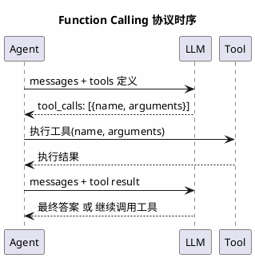
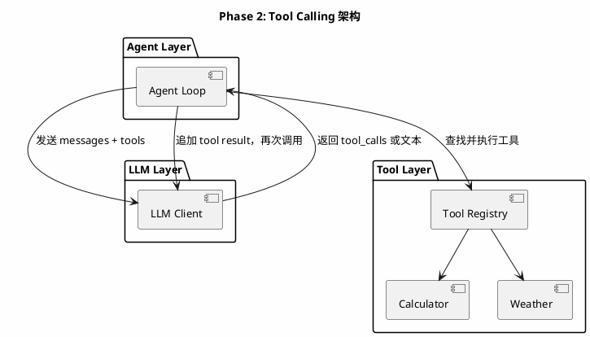
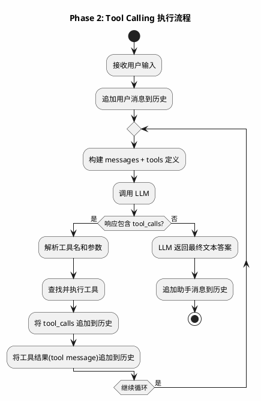
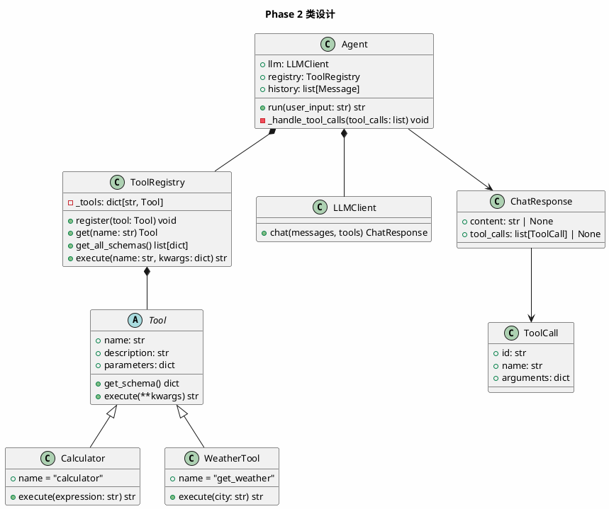
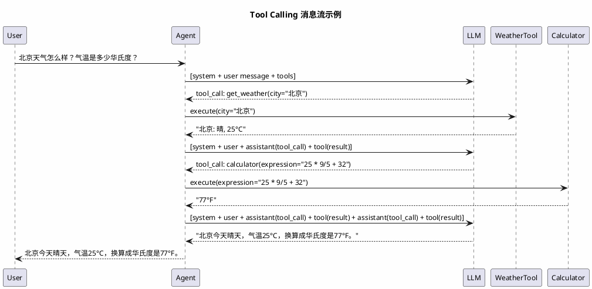

# Phase 2: Tool Calling

## 设计目标

让 LLM 能够"做事"——通过 Function Calling 协议，LLM 可以调用预定义的工具，获取执行结果，再基于结果继续推理。

这是 Agent 从"聊天机器人"进化为"智能体"的关键一步。

## 为什么这样设计

### 为什么需要 Tool Calling？

Phase 1 的 Agent 只能"说话"。你问它"当前目录有什么文件？"，它只能猜——因为它没有能力执行任何操作。

Tool Calling 解决了这个问题：

1. **LLM 决定调用什么工具** — 不是硬编码的，而是 LLM 根据用户意图自主选择
2. **Agent 执行工具** — Agent 是执行者，LLM 是决策者
3. **结果反馈给 LLM** — LLM 基于工具结果继续推理

### Function Calling 协议的本质

OpenAI 的 Function Calling 协议非常简洁：

```
请求: messages + tools 定义
响应: tool_calls (工具名 + 参数)
反馈: tool message (工具执行结果)
```



### 各产品如何实现 Tool Calling？

| 产品 | 实现方式 | 特点 |
|------|---------|------|
| Claude Code | Anthropic Tool Use API | 工具定义在 `tools` 字段，响应中 `tool_use` content block |
| Cursor Agent | OpenAI Function Calling | 工具包括 file_search, edit_file, terminal |
| Aider | 纯文本协议 | LLM 输出 SEARCH/REPLACE 块，正则解析 |
| OpenCode | OpenAI Function Calling | 标准实现，工具注册机制 |

**关键洞察**：Aider 不使用 Function Calling，而是让 LLM 在纯文本中输出结构化指令。这说明 Tool Calling 不是唯一方案，但它是**最标准化、最可靠**的方案。

### 为什么用 Function Calling 而不是纯文本解析？

1. **结构化** — JSON 参数比正则解析可靠得多
2. **标准化** — 所有主流 LLM 都支持，模型间可切换
3. **类型安全** — 参数有 JSON Schema 约束，减少错误
4. **模型训练** — LLM 专门训练过 Function Calling，准确率远高于文本解析

## 架构图



## 流程图



## 类图



## 目录结构

```
src/
├── agent/
│   ├── __init__.py
│   └── base.py          # Agent（升级：支持 Tool Calling）
├── llm/
│   ├── __init__.py
│   └── base.py          # LLMClient（升级：支持 tools 参数）
├── tools/
│   ├── __init__.py
│   ├── base.py          # Tool 基类 + ToolRegistry
│   ├── calculator.py    # 计算器工具（示例）
│   └── weather.py       # 天气工具（示例）
└── main.py              # 入口
```

## 核心代码

### Tool — 工具基类

```python
# src/tools/read.py
from abc import ABC, abstractmethod


class Tool(ABC):
    @property
    @abstractmethod
    def name(self) -> str:
        ...

    @property
    @abstractmethod
    def description(self) -> str:
        ...

    @property
    @abstractmethod
    def parameters(self) -> dict:
        """返回 JSON Schema 格式的参数定义"""
        ...

    def get_schema(self) -> dict:
        """返回 OpenAI Function Calling 格式的工具定义"""
        return {
            "type": "function",
            "function": {
                "name": self.name,
                "description": self.description,
                "parameters": self.parameters,
            },
        }

    @abstractmethod
    def execute(self, **kwargs) -> str:
        ...
```

**设计要点**：
- `parameters` 返回 JSON Schema，这是 OpenAI Function Calling 的标准格式
- `get_schema()` 封装了 OpenAI 要求的工具定义结构，子类无需关心
- `execute()` 返回字符串——工具结果最终要作为消息发给 LLM，必须是文本

### ToolRegistry — 工具注册表

```python
# src/tools/read.py (续)
class ToolRegistry:
    def __init__(self):
        self._tools: dict[str, Tool] = {}

    def register(self, tool: Tool) -> None:
        self._tools[tool.name] = tool

    def get(self, name: str) -> Tool:
        if name not in self._tools:
            raise ValueError(f"工具 '{name}' 未注册")
        return self._tools[name]

    def get_all_schemas(self) -> list[dict]:
        return [tool.get_schema() for tool in self._tools.values()]

    def execute(self, name: str, kwargs: dict) -> str:
        tool = self.get(name)
        return tool.execute(**kwargs)
```

**设计要点**：
- 注册表模式——解耦 Agent 和具体工具实现
- `get_all_schemas()` 直接传给 LLM API 的 `tools` 参数
- 后续 Phase 会添加工具发现、MCP 工具注册等能力

### Calculator — 示例工具

```python
# src/tools/calculator.py
from tools.base import Tool


class Calculator(Tool):
    @property
    def name(self) -> str:
        return "calculator"

    @property
    def description(self) -> str:
        return "计算数学表达式。输入一个数学表达式，返回计算结果。"

    @property
    def parameters(self) -> dict:
        return {
            "type": "object",
            "properties": {
                "expression": {
                    "type": "string",
                    "description": "要计算的数学表达式，例如 '2 + 3 * 4'",
                }
            },
            "required": ["expression"],
        }

    def execute(self, expression: str) -> str:
        try:
            result = eval(expression)  # 注意：生产环境应使用安全解析器
            return f"计算结果: {expression} = {result}"
        except Exception as e:
            return f"计算错误: {e}"
```

### LLMClient — 升级支持 Tool Calling

```python
# src/llm/read.py (升级)
from dataclasses import dataclass, field


@dataclass
class Message:
    role: str
    content: str | None = None
    tool_calls: list | None = None
    tool_call_id: str | None = None

    def to_dict(self) -> dict:
        d: dict = {"role": self.role}
        if self.content is not None:
            d["content"] = self.content
        if self.tool_calls is not None:
            d["tool_calls"] = self.tool_calls
        if self.tool_call_id is not None:
            d["tool_call_id"] = self.tool_call_id
        return d


@dataclass
class ToolCallInfo:
    id: str
    name: str
    arguments: dict


@dataclass
class ChatResponse:
    content: str | None = None
    tool_calls: list[ToolCallInfo] | None = None


class LLMClient:
    # ... (构造函数同 Phase 1)

    def chat(self, messages: list[Message], tools: list[dict] | None = None) -> ChatResponse:
        kwargs: dict = {
            "model": self.model,
            "messages": [m.to_dict() for m in messages],
        }
        if tools:
            kwargs["tools"] = tools

        response = self.client.chat.completions.create(**kwargs)
        choice = response.choices[0]

        result = ChatResponse()
        if choice.message.content:
            result.content = choice.message.content

        if choice.message.tool_calls:
            result.tool_calls = []
            for tc in choice.message.tool_calls:
                import json
                result.tool_calls.append(ToolCallInfo(
                    id=tc.id,
                    name=tc.function.name,
                    arguments=json.loads(tc.function.arguments),
                ))

        return result
```

**设计要点**：
- `Message` 新增 `tool_calls` 和 `tool_call_id` 字段——OpenAI API 要求
- `ChatResponse` 区分文本响应和工具调用响应
- `ToolCallInfo` 封装工具调用信息，对齐 OpenAI 格式

### Agent — 升级支持 Tool Calling

```python
# src/agent/read.py (升级)
class Agent:
    def __init__(self, llm: LLMClient, registry: ToolRegistry, system_prompt: str = "你是一个有用的助手。"):
        self.llm = llm
        self.registry = registry
        self.system_prompt = system_prompt
        self.history: list[Message] = []

    def run(self, user_input: str) -> str:
        self.history.append(Message(role="user", content=user_input))

        while True:
            messages = [Message(role="system", content=self.system_prompt)]
            messages.extend(self.history)

            tools = self.registry.get_all_schemas()
            response = self.llm.chat(messages, tools=tools if tools else None)

            if response.tool_calls:
                # LLM 要调用工具
                # 1. 追加助手的 tool_calls 消息
                tool_calls_dicts = []
                for tc in response.tool_calls:
                    tool_calls_dicts.append({
                        "id": tc.id,
                        "type": "function",
                        "function": {
                            "name": tc.name,
                            "arguments": json.dumps(tc.arguments),
                        },
                    })
                self.history.append(Message(
                    role="assistant",
                    content=None,
                    tool_calls=tool_calls_dicts,
                ))

                # 2. 执行每个工具，追加 tool 消息
                for tc in response.tool_calls:
                    result = self.registry.execute(tc.name, tc.arguments)
                    self.history.append(Message(
                        role="tool",
                        content=result,
                        tool_call_id=tc.id,
                    ))
            else:
                # LLM 返回最终文本答案
                self.history.append(Message(role="assistant", content=response.content))
                return response.content
```

**设计要点**：
- **while True 循环** — 这是 Agent Loop 的核心！LLM 可能连续调用多个工具，每次调用后都需要再次调用 LLM
- **tool_calls 消息格式** — 严格遵循 OpenAI API 规范，assistant 消息带 `tool_calls`，tool 消息带 `tool_call_id`
- **多工具并行** — LLM 可能一次返回多个 tool_calls，需要逐个执行

## 消息流示例

用户问："北京天气怎么样？气温是多少华氏度？"



## 当前方案的问题

| 问题 | 说明 |
|------|------|
| **无循环控制** | while True 可能无限循环，需要最大步数限制 |
| **无错误恢复** | 工具执行失败后，LLM 不知道如何处理 |
| **无流式输出** | 用户需要等待整个循环结束才能看到结果 |
| **工具结果无截断** | 工具返回内容可能很长，超出 Token 限制 |
| **无并行执行** | 多个独立工具调用是串行执行的 |

### Claude Code 如何解决？

1. **最大步数** — 默认最多 200 步，防止无限循环
2. **错误反馈** — 工具执行错误时，将错误信息作为 tool message 返回，LLM 自动调整策略
3. **结果截断** — 工具返回超过一定长度时自动截断，保留前后部分
4. **流式输出** — 使用 SSE 流式返回 LLM 响应

### Cursor 如何解决？

1. **编辑确认** — 文件修改工具需要用户确认后才执行
2. **差异展示** — 修改以 diff 形式展示，用户可以接受/拒绝
3. **自动重试** — LLM 输出格式错误时，将错误反馈给 LLM 重试

### 工业界最佳实践

1. **最大步数限制** — 防止无限循环，通常 10-50 步
2. **错误即反馈** — 工具执行错误不是终止条件，而是新的观察信息
3. **工具结果截断** — 超长结果截断到 10000 字符左右
4. **超时控制** — 每个工具有执行超时限制

## 练习题

1. **基础**：实现 `Calculator` 和 `WeatherTool`，运行代码，验证 Tool Calling 流程。

2. **进阶**：为 Agent 添加最大步数限制（`max_steps`），超过后强制终止并返回当前状态。

3. **思考**：如果 LLM 返回了一个不存在的工具名，会发生什么？你会如何处理？

4. **挑战**：实现工具执行超时机制——如果工具执行超过 5 秒，返回超时错误信息给 LLM。

## 下一阶段目标

Phase 3 将实现 **ReAct Agent**——将 Tool Calling 组织成 Thought → Action → Observation 的推理循环，让 Agent 具备"边思考边行动"的能力。