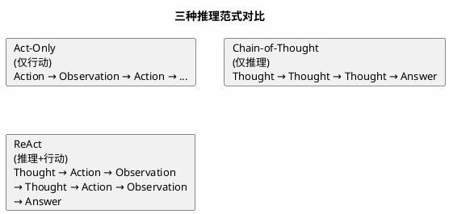
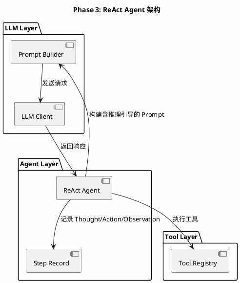
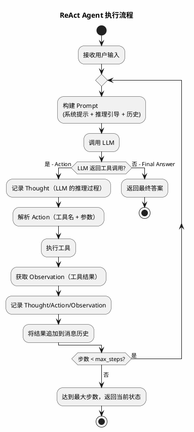
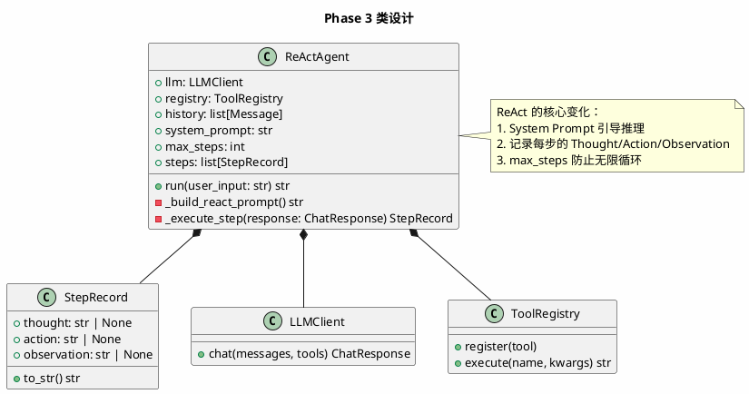

# Phase 3: ReAct Agent

## 设计目标

将 Tool Calling 组织成 **Thought → Action → Observation** 的推理循环，让 Agent 具备"边思考边行动"的能力。

ReAct（Reasoning + Acting）是当前最主流的 Agent 范式。理解它，你就理解了 Claude Code、Cursor Agent 等产品的核心运行机制。

## 为什么这样设计

### 为什么需要 ReAct？

Phase 2 的 Agent 已经能调用工具了，但存在一个关键问题：**LLM 的推理和行动是分离的**。

没有 ReAct 的 Agent：
```
用户: 帮我找出项目中所有 TODO 注释
LLM: [直接调用 search_file 工具]
结果: 可能搜索的关键词不对，返回空结果
```

有 ReAct 的 Agent：
```
用户: 帮我找出项目中所有 TODO 注释
Thought: 我需要搜索代码中的 TODO 注释，应该用 search_file 工具，搜索 "TODO" 关键词
Action: search_file(pattern="TODO")
Observation: 找到 15 个文件包含 TODO
Thought: 结果很多，我应该先看看有哪些类型的 TODO，可能需要分类
Action: read_file(path="src/main.py")
Observation: 文件内容...
Thought: 我看到了具体的 TODO，现在可以给用户一个完整的总结
Answer: 项目中共有 15 个文件包含 TODO 注释，主要分为以下几类...
```

**关键区别**：ReAct 让 LLM 在每一步都"思考"下一步该做什么，而不是盲目调用工具。

### ReAct 论文的核心思想

2022 年的论文《ReAct: Synergizing Reasoning and Acting in Language Models》提出：

1. **Reasoning（推理）** — LLM 生成思考过程（Thought），解释为什么要采取某个行动
2. **Acting（行动）** — LLM 选择并执行工具（Action）
3. **Observation（观察）** — 获取工具执行结果（Observation）

三者形成循环，直到 LLM 认为可以给出最终答案。

### ReAct vs Chain-of-Thought vs Act-Only



| 范式 | 优点 | 缺点 |
|------|------|------|
| Act-Only | 执行快 | 盲目行动，容易走错方向 |
| Chain-of-Thought | 推理深入 | 无法获取外部信息，容易"空想" |
| ReAct | 推理+行动结合 | Token 消耗更多 |

### 各产品如何使用 ReAct？

| 产品 | 实现方式 | 特点 |
|------|---------|------|
| Claude Code | 隐式 ReAct | LLM 内部推理，工具调用是 Action，工具结果是 Observation |
| Cursor Agent | 隐式 ReAct | LLM 输出包含推理过程，编辑指令是 Action |
| Aider | 显式 ReAct | LLM 输出思考过程 + SEARCH/REPLACE 块 |
| LangChain ReAct | 显式 ReAct | 用 Prompt 模板强制 LLM 输出 Thought/Action/Observation |

**关键洞察**：Claude Code 和 Cursor 使用"隐式 ReAct"——LLM 内部推理，不需要在输出中显式写 "Thought:"。这是因为现代 LLM 已经被训练得足够好，能自然地推理+行动。

### 我们如何实现？

我们采用**混合方式**：
- 使用 Function Calling 作为 Action 机制（Phase 2 已实现）
- 在 System Prompt 中引导 LLM 先思考再行动
- 不强制输出 "Thought:" 标签，但记录推理过程

## 架构图



## 流程图



## 类图



## 目录结构

```
src/
├── agent/
│   ├── __init__.py
│   ├── base.py          # Agent 基类（Phase 2）
│   └── react.py         # ReAct Agent（新增）
├── llm/
│   ├── __init__.py
│   └── base.py
├── tools/
│   ├── __init__.py
│   ├── base.py
│   ├── calculator.py
│   └── weather.py
└── main.py
```

## 核心代码

### StepRecord — 步骤记录

```python
# src/agent/react.py
from dataclasses import dataclass


@dataclass
class StepRecord:
    thought: str | None = None
    action: str | None = None
    observation: str | None = None

    def to_str(self) -> str:
        parts = []
        if self.thought:
            parts.append(f"Thought: {self.thought}")
        if self.action:
            parts.append(f"Action: {self.action}")
        if self.observation:
            parts.append(f"Observation: {self.observation}")
        return "\n".join(parts)
```

### ReActAgent — ReAct 智能体

```python
# src/agent/react.py (续)
import json
from llm.base import LLMClient, Message, ChatResponse
from tools.base import ToolRegistry

REACT_SYSTEM_PROMPT = """你是一个智能助手，能够通过推理和行动来解决问题。

在解决用户问题时，请遵循以下步骤：
1. 思考（Thought）：分析当前情况，决定下一步该做什么
2. 行动（Action）：调用合适的工具来获取信息或执行操作
3. 观察（Observation）：分析工具返回的结果

你可以多次重复以上步骤，直到获得足够信息来回答用户问题。

重要规则：
- 每次只调用一个工具
- 仔细分析工具返回的结果
- 如果工具返回错误，思考原因并尝试其他方法
- 当你确信已经找到答案时，直接给出最终回答
"""


class ReActAgent:
    def __init__(
        self,
        llm: LLMClient,
        registry: ToolRegistry,
        system_prompt: str = REACT_SYSTEM_PROMPT,
        max_steps: int = 10,
    ):
        self.llm = llm
        self.registry = registry
        self.system_prompt = system_prompt
        self.max_steps = max_steps
        self.history: list[Message] = []
        self.steps: list[StepRecord] = []

    def run(self, user_input: str) -> str:
        self.history.append(Message(role="user", content=user_input))
        self.steps = []

        for step_num in range(self.max_steps):
            messages = self._build_messages()
            tools = self.registry.get_all_schemas()
            response = self.llm.chat(messages, tools=tools if tools else None)

            if response.tool_calls:
                # Action: LLM 选择调用工具
                tc = response.tool_calls[0]  # ReAct: 每次只调用一个工具

                step = StepRecord(
                    thought=response.content,
                    action=f"{tc.name}({json.dumps(tc.arguments, ensure_ascii=False)})",
                )

                # 执行工具
                try:
                    result = self.registry.execute(tc.name, tc.arguments)
                    step.observation = result
                except Exception as e:
                    step.observation = f"工具执行错误: {e}"

                self.steps.append(step)

                # 追加到消息历史
                tool_calls_dicts = [{
                    "id": tc.id,
                    "type": "function",
                    "function": {
                        "name": tc.name,
                        "arguments": json.dumps(tc.arguments),
                    },
                }]
                self.history.append(Message(
                    role="assistant",
                    content=response.content,
                    tool_calls=tool_calls_dicts,
                ))
                self.history.append(Message(
                    role="tool",
                    content=step.observation,
                    tool_call_id=tc.id,
                ))

                print(f"\n[Step {step_num + 1}]")
                if step.thought:
                    print(f"  Thought: {step.thought}")
                print(f"  Action: {step.action}")
                print(f"  Observation: {step.observation[:200]}...")
            else:
                # Final Answer
                self.history.append(Message(role="assistant", content=response.content))
                return response.content

        return "达到最大步数限制，未能完成任务。"

    def _build_messages(self) -> list[Message]:
        messages = [Message(role="system", content=self.system_prompt)]
        messages.extend(self.history)
        return messages
```

**设计要点**：

1. **REACT_SYSTEM_PROMPT** — 引导 LLM 先思考再行动，这是 ReAct 的灵魂
2. **每次只调用一个工具** — ReAct 的核心约束，确保每步都有明确的推理
3. **StepRecord** — 记录每步的 Thought/Action/Observation，方便调试和展示
4. **max_steps** — 防止无限循环的安全阀
5. **错误即反馈** — 工具执行错误时，将错误信息作为 Observation 返回

### main.py — 入口升级

```python
# main.py
from agent.react import ReActAgent
from llm.base import LLMClient
from tools.base import ToolRegistry
from tools.calculator import Calculator
from tools.weather import WeatherTool


def main():
    llm = LLMClient()
    registry = ToolRegistry()
    registry.register(Calculator())
    registry.register(WeatherTool())

    agent = ReActAgent(llm=llm, registry=registry)

    print("Coding Agent v0.3 — ReAct Agent")
    print("输入 'quit' 退出\n")

    while True:
        user_input = input("你: ").strip()
        if user_input.lower() == "quit":
            break
        if not user_input:
            continue

        response = agent.run(user_input)
        print(f"\n助手: {response}\n")


if __name__ == "__main__":
    main()
```

## ReAct 执行示例

用户问："北京和上海哪个城市更热？"

```
[Step 1]
  Thought: 我需要查询北京和上海的天气，然后比较温度
  Action: get_weather(city="北京")
  Observation: 北京: 晴, 32°C

[Step 2]
  Thought: 已获取北京温度32°C，现在查询上海
  Action: get_weather(city="上海")
  Observation: 上海: 多云, 35°C

[Step 3]
  Thought: 北京32°C，上海35°C，上海更热
  (无工具调用，返回最终答案)

助手: 上海更热。北京今天32°C（晴天），上海35°C（多云），上海比北京高3°C。
```

## 当前方案的问题

| 问题 | 说明 |
|------|------|
| **工具太少** | 只有 Calculator 和 Weather，无法做实际编程任务 |
| **无文件操作** | 不能读文件、写文件、搜索代码 |
| **无终端执行** | 不能运行命令、执行测试 |
| **单工具调用** | ReAct 每步只调用一个工具，效率较低 |
| **无上下文管理** | 历史无限增长 |
| **无 Planning** | 复杂任务缺乏整体规划 |

### Claude Code 如何解决？

Claude Code 的工具集非常丰富：
- `Read` — 读文件
- `Write` — 写文件
- `Edit` — 编辑文件（搜索替换）
- `Bash` — 执行终端命令
- `Glob` — 文件模式匹配
- `Grep` — 内容搜索

这些工具让 Agent 具备了完整的编程能力。Phase 4-5 将实现这些工具。

### Cursor 如何解决？

Cursor 的工具更偏向编辑：
- `@file` — 引用文件
- `Codebase Search` — 语义搜索
- `Terminal` — 执行命令
- `Edit` — 编辑文件

### 工业界最佳实践

1. **工具设计原则** — 每个工具职责单一，参数简洁，返回结构化
2. **工具描述很重要** — LLM 根据工具描述决定调用哪个工具，描述必须清晰
3. **错误信息要丰富** — 工具执行失败时，返回足够的上下文让 LLM 理解原因
4. **工具结果要截断** — 防止超长结果消耗过多 Token

## 练习题

1. **基础**：运行 ReAct Agent，尝试多步推理问题（如"计算 (15 + 27) * 3 的结果"）。

2. **进阶**：实现一个 `DateTimeTool`，让 Agent 能查询当前时间。观察 LLM 如何在推理中使用时间信息。

3. **思考**：ReAct 每步只调用一个工具，但有时需要并行调用多个工具（如同时查询北京和上海天气）。你会如何设计来支持并行工具调用？

4. **挑战**：实现一个 `WebSearchTool`（可使用模拟数据），让 Agent 能搜索网络信息。观察 ReAct 循环如何处理"搜索 → 阅读 → 再搜索"的多步流程。

## 下一阶段目标

Phase 4 将实现**文件系统工具**——让 Agent 能够读文件、写文件、列出目录、搜索文件，具备代码理解能力。