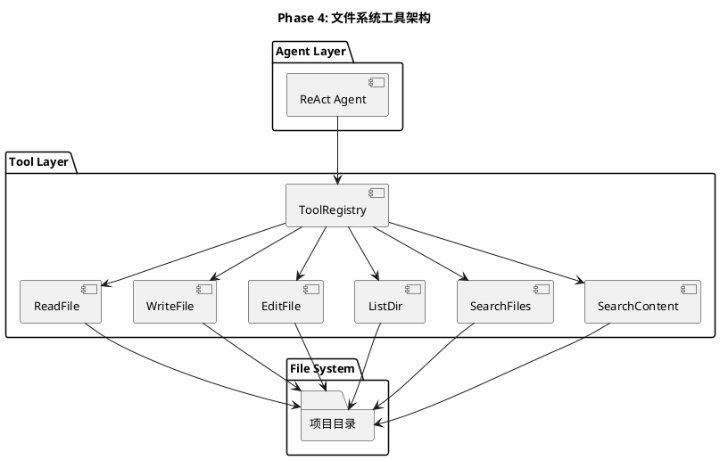
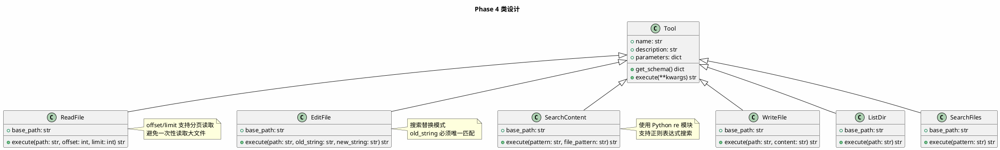

# Phase 4: 文件系统工具

## 设计目标

为 Agent 添加文件系统操作能力：读文件、写文件、列出目录、搜索文件。这是 Agent 从"通用助手"进化为"编程助手"的关键一步。

## 为什么这样设计

### 为什么需要文件系统工具？

没有文件系统工具的 Agent，就像一个不能打开电脑的程序员——只能凭记忆和猜测工作。

有了文件系统工具：

```
用户: 分析一下这个项目的结构
Agent:
  1. list_dir(".") → 看到项目根目录
  2. list_dir("src") → 看到源码目录
  3. read_file("pyproject.toml") → 了解依赖
  4. read_file("src/main.py") → 了解入口
  → 给出完整分析
```

### 各产品的文件系统工具对比

| 工具 | Claude Code | Cursor | Aider | OpenCode |
|------|------------|--------|-------|----------|
| 读文件 | `Read` | `@file` | 读取整个文件 | `read_file` |
| 写文件 | `Write` | 编辑指令 | SEARCH/REPLACE | `write_file` |
| 编辑文件 | `Edit`（搜索替换） | 编辑指令 | SEARCH/REPLACE | `edit_file` |
| 列目录 | `LS` | 文件树 | `ls` | `list_dir` |
| 搜索文件 | `Glob` | Codebase Search | `ls` | `glob` |
| 搜索内容 | `Grep` | Codebase Search | `search` | `grep` |

### 关键设计决策：Edit vs Write

有两种文件编辑方式：

1. **Write（全量写入）** — 写入整个文件内容
2. **Edit（搜索替换）** — 只修改文件中变化的部分


**我们的策略**：两者都实现。小文件用 Write，大文件用 Edit。

### Claude Code 的 Edit 工具设计

Claude Code 的 `Edit` 工具使用搜索替换模式：

```
old_string: "要替换的原始文本"
new_string: "替换后的新文本"
```

如果 `old_string` 在文件中不唯一，操作会失败——这迫使 LLM 提供足够的上下文来唯一定位。

### Aider 的 SEARCH/REPLACE 设计

Aider 使用特殊标记：

```
<<<<<<< SEARCH
原始代码
=======
新代码
>>>>>>> REPLACE
```

这种方式在纯文本中表达编辑，不依赖 Function Calling。

## 架构图



## 类图



## 目录结构

```
src/
├── agent/
│   ├── __init__.py
│   ├── base.py
│   └── react.py
├── llm/
│   ├── __init__.py
│   └── base.py
├── tools/
│   ├── __init__.py
│   ├── base.py
│   ├── calculator.py
│   ├── weather.py
│   └── file_tools.py    # 文件系统工具（新增）
└── main.py
```

## 核心代码

### ReadFile — 读文件

```python
# src/tools/file_tools.py
import os
from pathlib import Path
from tools.base import Tool


class ReadFile(Tool):
    def __init__(self, base_path: str = "."):
        self.base_path = Path(base_path).resolve()

    @property
    def name(self) -> str:
        return "read_file"

    @property
    def description(self) -> str:
        return "读取文件内容。可以指定偏移量和行数来分页读取大文件。"

    @property
    def parameters(self) -> dict:
        return {
            "type": "object",
            "properties": {
                "path": {
                    "type": "string",
                    "description": "文件路径（相对于项目根目录）",
                },
                "offset": {
                    "type": "integer",
                    "description": "起始行号（从1开始），默认1",
                    "default": 1,
                },
                "limit": {
                    "type": "integer",
                    "description": "读取的最大行数，默认2000",
                    "default": 2000,
                },
            },
            "required": ["path"],
        }

    def execute(self, path: str, offset: int = 1, limit: int = 2000) -> str:
        file_path = self._resolve_path(path)
        if not file_path.exists():
            return f"错误: 文件不存在: {path}"
        if not file_path.is_file():
            return f"错误: 路径不是文件: {path}"

        try:
            lines = file_path.read_text(encoding="utf-8").splitlines()
            selected = lines[offset - 1 : offset - 1 + limit]
            numbered = [f"{offset + i}: {line}" for i, line in enumerate(selected)]
            total = len(lines)
            result = "\n".join(numbered)
            if offset + limit - 1 < total:
                result += f"\n... (共 {total} 行，已显示第 {offset}-{offset + len(selected) - 1} 行)"
            return result
        except Exception as e:
            return f"读取文件错误: {e}"

    def _resolve_path(self, path: str) -> Path:
        resolved = (self.base_path / path).resolve()
        if not str(resolved).startswith(str(self.base_path)):
            raise ValueError(f"路径超出项目范围: {path}")
        return resolved
```

**设计要点**：
- **base_path** — 所有路径相对于项目根目录，防止路径穿越攻击
- **offset/limit** — 分页读取，避免大文件一次性加载
- **行号显示** — 每行前加行号，方便 LLM 定位代码
- **路径安全** — `_resolve_path` 防止 `../../etc/passwd` 类攻击

### WriteFile — 写文件

```python
class WriteFile(Tool):
    def __init__(self, base_path: str = "."):
        self.base_path = Path(base_path).resolve()

    @property
    def name(self) -> str:
        return "write_file"

    @property
    def description(self) -> str:
        return "将内容写入文件。如果文件不存在则创建，如果存在则覆盖。"

    @property
    def parameters(self) -> dict:
        return {
            "type": "object",
            "properties": {
                "path": {
                    "type": "string",
                    "description": "文件路径（相对于项目根目录）",
                },
                "content": {
                    "type": "string",
                    "description": "要写入的文件内容",
                },
            },
            "required": ["path", "content"],
        }

    def execute(self, path: str, content: str) -> str:
        file_path = self._resolve_path(path)
        try:
            file_path.parent.mkdir(parents=True, exist_ok=True)
            file_path.write_text(content, encoding="utf-8")
            line_count = content.count("\n") + 1
            return f"成功写入文件: {path} ({line_count} 行)"
        except Exception as e:
            return f"写入文件错误: {e}"

    def _resolve_path(self, path: str) -> Path:
        resolved = (self.base_path / path).resolve()
        if not str(resolved).startswith(str(self.base_path)):
            raise ValueError(f"路径超出项目范围: {path}")
        return resolved
```

### EditFile — 编辑文件（搜索替换）

```python
class EditFile(Tool):
    def __init__(self, base_path: str = "."):
        self.base_path = Path(base_path).resolve()

    @property
    def name(self) -> str:
        return "edit_file"

    @property
    def description(self) -> str:
        return (
            "编辑文件：搜索文件中的原始文本并替换为新文本。"
            "原始文本必须在文件中唯一匹配，否则操作失败。"
        )

    @property
    def parameters(self) -> dict:
        return {
            "type": "object",
            "properties": {
                "path": {
                    "type": "string",
                    "description": "文件路径（相对于项目根目录）",
                },
                "old_string": {
                    "type": "string",
                    "description": "要被替换的原始文本（必须在文件中唯一匹配）",
                },
                "new_string": {
                    "type": "string",
                    "description": "替换后的新文本",
                },
            },
            "required": ["path", "old_string", "new_string"],
        }

    def execute(self, path: str, old_string: str, new_string: str) -> str:
        file_path = self._resolve_path(path)
        if not file_path.exists():
            return f"错误: 文件不存在: {path}"

        try:
            content = file_path.read_text(encoding="utf-8")
            count = content.count(old_string)
            if count == 0:
                return f"错误: 未找到匹配的文本。请检查 old_string 是否与文件内容完全一致。"
            if count > 1:
                return f"错误: 找到 {count} 处匹配，old_string 必须唯一匹配。请提供更多上下文。"

            new_content = content.replace(old_string, new_string)
            file_path.write_text(new_content, encoding="utf-8")
            return f"成功编辑文件: {path}"
        except Exception as e:
            return f"编辑文件错误: {e}"

    def _resolve_path(self, path: str) -> Path:
        resolved = (self.base_path / path).resolve()
        if not str(resolved).startswith(str(self.base_path)):
            raise ValueError(f"路径超出项目范围: {path}")
        return resolved
```

**设计要点**：
- **唯一匹配约束** — `old_string` 必须在文件中唯一，防止误替换
- **精确匹配** — 不使用模糊匹配，避免不可预测的行为
- **错误信息丰富** — 告诉 LLM 是"未找到"还是"多处匹配"，帮助它调整策略

### ListDir — 列出目录

```python
class ListDir(Tool):
    def __init__(self, base_path: str = "."):
        self.base_path = Path(base_path).resolve()

    @property
    def name(self) -> str:
        return "list_dir"

    @property
    def description(self) -> str:
        return "列出目录中的文件和子目录。"

    @property
    def parameters(self) -> dict:
        return {
            "type": "object",
            "properties": {
                "path": {
                    "type": "string",
                    "description": "目录路径（相对于项目根目录），默认为根目录",
                    "default": ".",
                },
            },
            "required": [],
        }

    def execute(self, path: str = ".") -> str:
        dir_path = self._resolve_path(path)
        if not dir_path.exists():
            return f"错误: 目录不存在: {path}"
        if not dir_path.is_dir():
            return f"错误: 路径不是目录: {path}"

        try:
            entries = sorted(dir_path.iterdir())
            result_lines = []
            for entry in entries:
                name = entry.name
                if entry.is_dir():
                    name += "/"
                result_lines.append(name)
            return "\n".join(result_lines)
        except Exception as e:
            return f"列出目录错误: {e}"

    def _resolve_path(self, path: str) -> Path:
        resolved = (self.base_path / path).resolve()
        if not str(resolved).startswith(str(self.base_path)):
            raise ValueError(f"路径超出项目范围: {path}")
        return resolved
```

### SearchFiles — 搜索文件名

```python
class SearchFiles(Tool):
    def __init__(self, base_path: str = "."):
        self.base_path = Path(base_path).resolve()

    @property
    def name(self) -> str:
        return "search_files"

    @property
    def description(self) -> str:
        return "使用 glob 模式搜索文件名。支持 ** 递归匹配。"

    @property
    def parameters(self) -> dict:
        return {
            "type": "object",
            "properties": {
                "pattern": {
                    "type": "string",
                    "description": "glob 模式，例如 '**/*.py' 匹配所有 Python 文件",
                },
            },
            "required": ["pattern"],
        }

    def execute(self, pattern: str) -> str:
        try:
            matches = sorted(self.base_path.glob(pattern))
            if not matches:
                return f"未找到匹配 '{pattern}' 的文件"
            result = []
            for m in matches[:100]:
                rel = m.relative_to(self.base_path)
                result.append(str(rel))
            output = "\n".join(result)
            if len(matches) > 100:
                output += f"\n... (共 {len(matches)} 个文件，仅显示前 100 个)"
            return output
        except Exception as e:
            return f"搜索文件错误: {e}"
```

### SearchContent — 搜索文件内容

```python
import re


class SearchContent(Tool):
    def __init__(self, base_path: str = "."):
        self.base_path = Path(base_path).resolve()

    @property
    def name(self) -> str:
        return "search_content"

    @property
    def description(self) -> str:
        return "使用正则表达式搜索文件内容。返回匹配的文件名、行号和内容。"

    @property
    def parameters(self) -> dict:
        return {
            "type": "object",
            "properties": {
                "pattern": {
                    "type": "string",
                    "description": "正则表达式模式",
                },
                "file_pattern": {
                    "type": "string",
                    "description": "文件名 glob 模式，例如 '*.py'，默认搜索所有文件",
                    "default": "*",
                },
            },
            "required": ["pattern"],
        }

    def execute(self, pattern: str, file_pattern: str = "*") -> str:
        try:
            regex = re.compile(pattern)
        except re.error as e:
            return f"正则表达式错误: {e}"

        results = []
        skip_dirs = {".git", "__pycache__", "node_modules", ".venv", "venv"}

        for file_path in sorted(self.base_path.glob(f"**/{file_pattern}")):
            if any(part in skip_dirs for part in file_path.parts):
                continue
            if not file_path.is_file():
                continue
            try:
                content = file_path.read_text(encoding="utf-8", errors="ignore")
                for i, line in enumerate(content.splitlines(), 1):
                    if regex.search(line):
                        rel = file_path.relative_to(self.base_path)
                        results.append(f"{rel}:{i}: {line.strip()}")
                        if len(results) >= 50:
                            return "\n".join(results) + "\n... (结果过多，仅显示前 50 条)"
            except Exception:
                continue

        if not results:
            return f"未找到匹配 '{pattern}' 的内容"
        return "\n".join(results)
```

## 工具注册

```python
# main.py 中注册文件工具
from tools.file_tools import ReadFile, WriteFile, EditFile, ListDir, SearchFiles, SearchContent

def create_file_tools(base_path: str = ".") -> list:
    return [
        ReadFile(base_path),
        WriteFile(base_path),
        EditFile(base_path),
        ListDir(base_path),
        SearchFiles(base_path),
        SearchContent(base_path),
    ]
```

## 当前方案的问题

| 问题 | 说明 |
|------|------|
| **无终端执行** | 不能运行命令、执行测试、操作 git |
| **无代码索引** | 大型项目中搜索效率低 |
| **无文件确认** | 写入/编辑文件没有确认步骤，可能误操作 |
| **无 diff 预览** | 编辑文件前无法预览变更 |
| **二进制文件** | 读取二进制文件会出错 |

### Claude Code 如何解决？

1. **Bash 工具** — 可以执行任何终端命令
2. **文件确认** — 对于敏感操作（如删除文件），需要用户确认
3. **Read 先行** — LLM 在编辑文件前必须先读取，确保 old_string 准确

### Cursor 如何解决？

1. **Diff 预览** — 编辑以 diff 形式展示，用户可以接受/拒绝
2. **自动保存** — 编辑后自动保存，但保留 undo 历史

### 工业界最佳实践

1. **路径安全** — 所有文件操作必须限制在项目目录内
2. **读取优先** — 编辑前先读取，确保 LLM 知道文件当前内容
3. **结果截断** — 大文件/多结果时截断，保留关键信息
4. **错误恢复** — 编辑失败时文件内容不变

## 练习题

1. **基础**：注册所有文件工具，让 Agent 能列出当前目录、读取文件、搜索内容。

2. **进阶**：让 Agent 分析一个 Python 项目的结构——列出文件、读取入口文件、搜索所有类定义。

3. **思考**：`EditFile` 要求 `old_string` 唯一匹配。如果 LLM 提供的 `old_string` 有细微差异（如多了空格），会导致匹配失败。你会如何改进？

4. **挑战**：为 `EditFile` 添加 `replace_all` 参数，支持全局替换。同时添加安全检查：如果替换超过 10 处，返回警告而非直接执行。

## 下一阶段目标

Phase 5 将实现**终端工具**——让 Agent 能执行 shell 命令，运行代码、执行测试、操作 git。