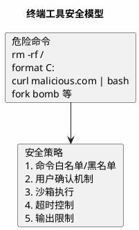
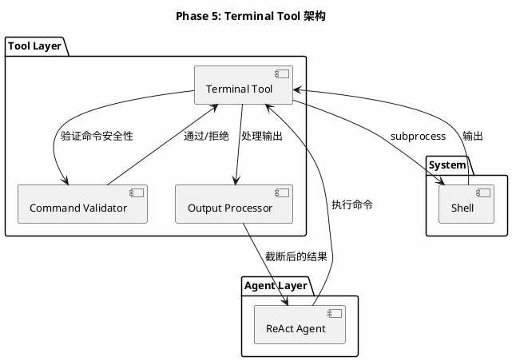
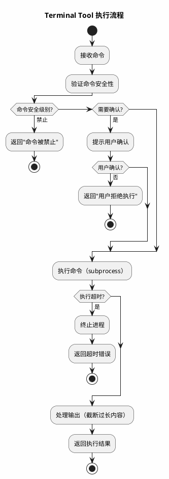
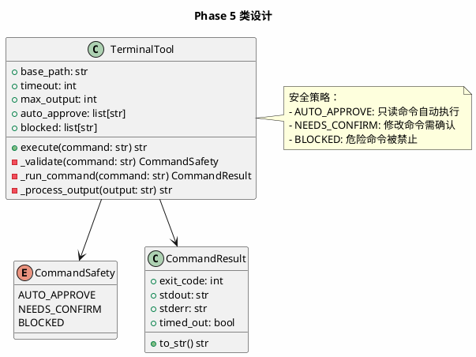

# Phase 5: Terminal Tool

## 设计目标

为 Agent 添加终端命令执行能力——让 Agent 能运行代码、执行测试、操作 git，成为真正的编程助手。

## 为什么这样设计

### 为什么需要终端工具？

文件系统工具让 Agent 能"看"和"改"代码，但编程不仅仅是读写文件：

- **运行代码** — 修改后需要运行验证
- **执行测试** — 确保修改没有引入 bug
- **Git 操作** — 提交代码、查看历史
- **安装依赖** — pip install, npm install
- **构建部署** — docker build, terraform apply

没有终端工具的 Agent，就像一个只能写代码但不能运行代码的程序员。

### 终端工具的安全挑战

终端工具是最危险的工具——它可以执行任意命令。



### 各产品的终端工具设计

| 产品 | 实现方式 | 安全策略 |
|------|---------|---------|
| Claude Code | `Bash` 工具 | 用户确认 + 超时 + 输出截断 |
| Cursor Agent | `Terminal` 工具 | 用户确认 + 沙箱 |
| Aider | `/run` 命令 | 直接执行，无确认 |
| OpenCode | `shell` 工具 | 命令白名单 |

**关键洞察**：Claude Code 的 Bash 工具默认需要用户确认。但为了流畅体验，某些安全命令（如 `git status`、`ls`）可以自动执行。

### 我们的安全策略

采用**分级执行**：

1. **自动执行** — 只读命令（git status, ls, cat, test）
2. **确认执行** — 修改命令（git commit, pip install, python）
3. **禁止执行** — 危险命令（rm -rf, format, curl | bash）

## 架构图



## 流程图



## 类图



## 目录结构

```
src/
├── agent/
│   ├── __init__.py
│   ├── base.py
│   └── react.py
├── llm/
│   ├── __init__.py
│   └── base.py
├── tools/
│   ├── __init__.py
│   ├── base.py
│   ├── calculator.py
│   ├── weather.py
│   ├── file_tools.py
│   └── terminal.py       # 终端工具（新增）
└── main.py
```

## 核心代码

### CommandResult — 命令执行结果

```python
# src/tools/terminal.py
from dataclasses import dataclass


@dataclass
class CommandResult:
    exit_code: int
    stdout: str
    stderr: str
    timed_out: bool = False

    def to_str(self, max_length: int = 10000) -> str:
        parts = []
        if self.timed_out:
            parts.append("[命令超时，已终止]")
        if self.exit_code != 0:
            parts.append(f"[退出码: {self.exit_code}]")
        if self.stdout:
            output = self.stdout
            if len(output) > max_length:
                half = max_length // 2
                output = output[:half] + "\n... (输出已截断) ...\n" + output[-half:]
            parts.append(output)
        if self.stderr:
            err = self.stderr
            if len(err) > max_length // 2:
                err = err[: max_length // 4] + "\n... (错误输出已截断) ...\n" + err[-max_length // 4 :]
            parts.append(f"[stderr]\n{err}")
        return "\n".join(parts)
```

### CommandSafety — 命令安全级别

```python
from enum import Enum


class CommandSafety(Enum):
    AUTO_APPROVE = "auto_approve"
    NEEDS_CONFIRM = "needs_confirm"
    BLOCKED = "blocked"
```

### TerminalTool — 终端工具

```python
import subprocess
import shlex
import re
from pathlib import Path
from tools.base import Tool


class TerminalTool(Tool):
    AUTO_APPROVE_PATTERNS = [
        r"^git status",
        r"^git log",
        r"^git diff",
        r"^git branch",
        r"^ls\b",
        r"^cat\b",
        r"^head\b",
        r"^tail\b",
        r"^find\b",
        r"^grep\b",
        r"^wc\b",
        r"^python.*-m\s+pytest",
        r"^python.*-m\s+unittest",
        r"^go test",
        r"^cargo test",
        r"^npm test",
    ]

    BLOCKED_PATTERNS = [
        r"rm\s+-rf\s+/",
        r"rm\s+-rf\s+~",
        r"format\s+[A-Z]:",
        r"curl.*\|\s*(ba)?sh",
        r"wget.*\|\s*(ba)?sh",
        r"dd\s+if=",
        r":\(\)\{\s*:\|:&\s*\}",
        r"mkfs",
        r"shutdown",
        r"reboot",
    ]

    def __init__(
        self,
        base_path: str = ".",
        timeout: int = 30,
        max_output: int = 10000,
        require_confirm: bool = True,
    ):
        self.base_path = Path(base_path).resolve()
        self.timeout = timeout
        self.max_output = max_output
        self.require_confirm = require_confirm

    @property
    def name(self) -> str:
        return "run_command"

    @property
    def description(self) -> str:
        return (
            "在终端中执行 shell 命令。"
            "支持 git、python、go、terraform 等命令。"
            "命令在项目目录下执行。"
        )

    @property
    def parameters(self) -> dict:
        return {
            "type": "object",
            "properties": {
                "command": {
                    "type": "string",
                    "description": "要执行的 shell 命令",
                },
                "timeout": {
                    "type": "integer",
                    "description": f"超时时间（秒），默认 {self.timeout}",
                    "default": self.timeout,
                },
            },
            "required": ["command"],
        }

    def execute(self, command: str, timeout: int | None = None) -> str:
        safety = self._validate(command)

        if safety == CommandSafety.BLOCKED:
            return f"命令被禁止执行: {command}\n该命令可能造成不可逆的损害。"

        if safety == CommandSafety.NEEDS_CONFIRM and self.require_confirm:
            confirm = input(f"\n⚠️  确认执行命令: {command}\n输入 'y' 确认: ").strip().lower()
            if confirm != "y":
                return "用户拒绝执行该命令。"

        result = self._run_command(command, timeout or self.timeout)
        return result.to_str(self.max_output)

    def _validate(self, command: str) -> CommandSafety:
        for pattern in self.BLOCKED_PATTERNS:
            if re.search(pattern, command):
                return CommandSafety.BLOCKED

        for pattern in self.AUTO_APPROVE_PATTERNS:
            if re.search(pattern, command):
                return CommandSafety.AUTO_APPROVE

        return CommandSafety.NEEDS_CONFIRM

    def _run_command(self, command: str, timeout: int) -> CommandResult:
        try:
            proc = subprocess.run(
                command,
                shell=True,
                capture_output=True,
                text=True,
                timeout=timeout,
                cwd=str(self.base_path),
            )
            return CommandResult(
                exit_code=proc.returncode,
                stdout=proc.stdout,
                stderr=proc.stderr,
            )
        except subprocess.TimeoutExpired:
            return CommandResult(
                exit_code=-1,
                stdout="",
                stderr=f"命令执行超时（{timeout}秒）",
                timed_out=True,
            )
        except Exception as e:
            return CommandResult(
                exit_code=-1,
                stdout="",
                stderr=f"命令执行错误: {e}",
            )
```

**设计要点**：

1. **分级安全策略** — AUTO_APPROVE / NEEDS_CONFIRM / BLOCKED 三级
2. **正则匹配** — 用正则表达式判断命令安全级别
3. **超时控制** — 防止命令无限运行
4. **输出截断** — 防止超长输出消耗过多 Token
5. **工作目录** — 命令在项目目录下执行
6. **用户确认** — 非只读命令需要用户确认（可配置关闭）

### main.py — 注册终端工具

```python
from tools.terminal import TerminalTool

# 在 main.py 中注册
terminal = TerminalTool(base_path=".", require_confirm=True)
registry.register(terminal)
```

## 终端工具使用示例

```
用户: 看看当前 git 状态
Agent:
  Thought: 需要查看 git 状态
  Action: run_command(command="git status")
  Observation: On branch main
               Changes not staged for commit:
                 modified: src/main.py
  → 自动执行（git status 是只读命令）

用户: 运行测试
Agent:
  Thought: 需要运行 pytest
  Action: run_command(command="python -m pytest tests/")
  ⚠️ 确认执行命令: python -m pytest tests/
  输入 'y' 确认: y
  Observation: 5 passed, 0 failed
  → 需要确认（运行代码命令）
```

## 当前方案的问题

| 问题 | 说明 |
|------|------|
| **同步阻塞** | 命令执行期间 Agent 完全阻塞 |
| **无流式输出** | 长时间命令看不到中间输出 |
| **无环境隔离** | 命令直接在宿主机执行，有安全风险 |
| **Windows 兼容** | shell=True 在 Windows 上行为不同 |
| **无后台任务** | 不支持长时间运行的服务（如 dev server） |

### Claude Code 如何解决？

1. **Bash 工具** — 使用 Node.js 的 child_process，支持流式输出
2. **超时默认 120 秒** — 用户可配置
3. **输出截断** — 超过 50000 字符自动截断
4. **用户确认** — 首次执行命令需要确认，后续可自动

### Cursor 如何解决？

1. **终端集成** — 命令在 Cursor 内置终端中执行，用户可见
2. **沙箱** — 部分操作在沙箱中执行

### 工业界最佳实践

1. **最小权限** — 只允许必要的命令
2. **超时必设** — 防止命令挂起
3. **输出必截** — 防止 Token 溢出
4. **确认机制** — 危险操作必须确认
5. **日志记录** — 记录所有执行的命令和结果

## 练习题

1. **基础**：注册 TerminalTool，让 Agent 能执行 `git status`、`ls` 等只读命令。

2. **进阶**：让 Agent 执行一个 Python 脚本并分析输出。观察 Agent 如何处理非零退出码。

3. **思考**：当前的安全策略基于正则匹配。如果用户输入 `git commit -m "rm -rf /"`，会被误判为危险命令吗？你会如何改进？

4. **挑战**：实现异步命令执行——使用 `asyncio.create_subprocess_shell` 替代 `subprocess.run`，支持流式输出。

## 下一阶段目标

Phase 6 将实现**代码库索引**——构建文件树、代码分块、向量嵌入和语义检索，让 Agent 能高效理解大型代码库。