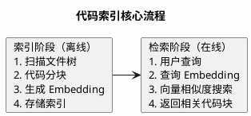
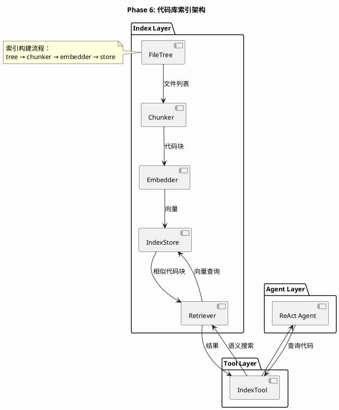
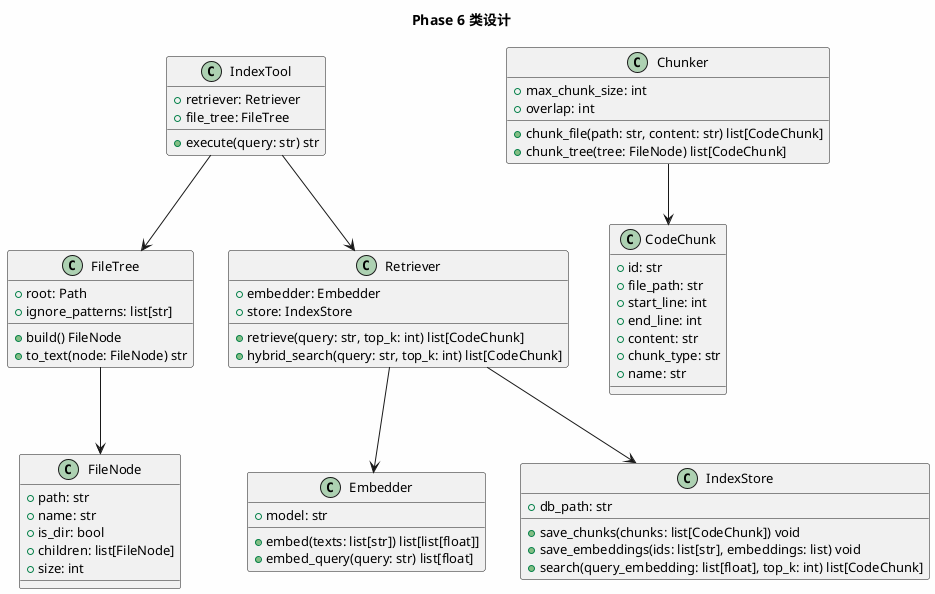

# Phase 6: 代码库索引

## 设计目标

为 Agent 构建代码库的索引能力——文件树、代码分块（Chunk）、向量嵌入（Embedding）和语义检索，让 Agent 能高效理解大型代码库。

## 为什么这样设计

### 为什么需要代码库索引？

Phase 4 的文件工具可以读文件、搜索内容，但对于大型项目存在严重问题：

```
项目: 500 个文件, 100000 行代码

用户: "用户认证的代码在哪里？"

方案1 (暴力搜索):
  search_content("auth") → 返回 200 条结果，信息过载

方案2 (逐个读文件):
  list_dir → read_file → read_file → ... → Token 耗尽

方案3 (代码索引):
  query("用户认证") → 返回最相关的 5 个代码块
```

**代码索引让 Agent 从"逐个翻阅"进化为"精准检索"**。

### 代码索引的核心流程



### 各产品的代码索引方案

| 产品 | 索引方案 | 特点 |
|------|---------|------|
| Claude Code | 无持久索引 | 每次对话动态读取文件，依赖 LLM 上下文窗口 |
| Cursor | 本地 Embedding 索引 | 后台构建索引，语义搜索 + 关键词搜索混合 |
| GitHub Copilot | 服务器端索引 | 代码上传到服务器，构建全局索引 |
| Aider | 无索引 | 使用 repo map（文件结构 + 函数签名） |

**关键洞察**：Claude Code **没有**持久索引！它依赖：
1. 大上下文窗口（200K tokens）
2. 动态文件读取
3. 智能文件选择策略

Cursor 使用本地索引，因为它的搜索需要实时响应。

### 我们的设计选择

采用**轻量级本地索引**：

1. **文件树** — 项目结构概览
2. **代码分块** — 按函数/类分块，保留语义完整性
3. **Embedding** — 使用 OpenAI Embedding API 或本地模型
4. **存储** — SQLite，无需外部数据库

## 架构图



## 类图



## 目录结构

```
src/
├── agent/
│   ├── __init__.py
│   ├── base.py
│   └── react.py
├── llm/
│   ├── __init__.py
│   └── base.py
├── tools/
│   ├── __init__.py
│   ├── base.py
│   ├── calculator.py
│   ├── weather.py
│   ├── file_tools.py
│   ├── terminal.py
│   └── index_tool.py   # 代码索引工具（新增）
├── index/               # 索引模块（新增）
│   ├── __init__.py
│   ├── file_tree.py     # 文件树
│   ├── chunker.py       # 代码分块
│   ├── embedder.py      # 向量嵌入
│   └── store.py         # 索引存储
└── main.py
```

## 核心代码

### FileTree — 文件树

```python
# src/index/file_tree.py
from dataclasses import dataclass, field
from pathlib import Path


IGNORE_DIRS = {
    ".git", "__pycache__", "node_modules", ".venv", "venv",
    "dist", "build", ".idea", ".vscode", ".arts", ".codeartsdoer",
}

IGNORE_EXTENSIONS = {
    ".pyc", ".pyo", ".so", ".dll", ".exe", ".bin",
    ".png", ".jpg", ".jpeg", ".gif", ".ico", ".svg",
    ".zip", ".tar", ".gz", ".rar",
}


@dataclass
class FileNode:
    path: str
    name: str
    is_dir: bool
    children: list["FileNode"] = field(default_factory=list)
    size: int = 0


class FileTree:
    def __init__(self, root: str = ".", ignore_dirs: set[str] | None = None):
        self.root = Path(root).resolve()
        self.ignore_dirs = ignore_dirs or IGNORE_DIRS

    def build(self) -> FileNode:
        return self._build_node(self.root, ".")

    def _build_node(self, path: Path, rel: str) -> FileNode:
        name = path.name
        is_dir = path.is_dir()

        node = FileNode(
            path=rel,
            name=name,
            is_dir=is_dir,
        )

        if is_dir:
            try:
                for child in sorted(path.iterdir()):
                    if child.name.startswith(".") and child.name not in {".env.example"}:
                        continue
                    if child.name in self.ignore_dirs:
                        continue
                    child_rel = f"{rel}/{child.name}" if rel != "." else child.name
                    node.children.append(self._build_node(child, child_rel))
            except PermissionError:
                pass
        else:
            if path.suffix in IGNORE_EXTENSIONS:
                node.size = 0
            else:
                try:
                    node.size = path.stat().st_size
                except OSError:
                    node.size = 0

        return node

    def to_text(self, node: FileNode | None = None, indent: int = 0) -> str:
        if node is None:
            node = self.build()

        lines = []
        prefix = "  " * indent
        if node.is_dir:
            lines.append(f"{prefix}{node.name}/")
            for child in node.children:
                lines.append(self.to_text(child, indent + 1))
        else:
            size_str = f" ({node.size}B)" if node.size else ""
            lines.append(f"{prefix}{node.name}{size_str}")
        return "\n".join(lines)
```

### Chunker — 代码分块

```python
# src/index/chunker.py
import uuid
from dataclasses import dataclass
from pathlib import Path


@dataclass
class CodeChunk:
    id: str
    file_path: str
    start_line: int
    end_line: int
    content: str
    chunk_type: str  # "function", "class", "module", "block"
    name: str        # 函数名/类名


class Chunker:
    def __init__(self, max_chunk_size: int = 1500, overlap: int = 100):
        self.max_chunk_size = max_chunk_size
        self.overlap = overlap

    def chunk_file(self, path: str, content: str) -> list[CodeChunk]:
        suffix = Path(path).suffix
        if suffix == ".py":
            return self._chunk_python(path, content)
        else:
            return self._chunk_generic(path, content)

    def _chunk_python(self, path: str, content: str) -> list[CodeChunk]:
        lines = content.splitlines()
        chunks = []
        current_block = []
        block_start = 0
        block_name = ""
        block_type = "module"

        for i, line in enumerate(lines):
            stripped = line.strip()

            if stripped.startswith("def ") or stripped.startswith("async def "):
                if current_block and len(current_block) >= 3:
                    chunks.append(self._make_chunk(
                        path, block_start, i, current_block, block_type, block_name
                    ))
                current_block = [line]
                block_start = i
                block_name = stripped.split("(")[0].replace("def ", "").replace("async ", "").strip()
                block_type = "function"

            elif stripped.startswith("class "):
                if current_block and len(current_block) >= 3:
                    chunks.append(self._make_chunk(
                        path, block_start, i, current_block, block_type, block_name
                    ))
                current_block = [line]
                block_start = i
                block_name = stripped.split("(")[0].replace("class ", "").strip(":")
                block_type = "class"

            else:
                current_block.append(line)

        if current_block:
            chunks.append(self._make_chunk(
                path, block_start, len(lines), current_block, block_type, block_name
            ))

        return chunks

    def _chunk_generic(self, path: str, content: str) -> list[CodeChunk]:
        lines = content.splitlines()
        chunks = []

        for i in range(0, len(lines), self.max_chunk_size - self.overlap):
            end = min(i + self.max_chunk_size, len(lines))
            chunk_lines = lines[i:end]
            chunks.append(self._make_chunk(
                path, i + 1, end, chunk_lines, "block", f"lines_{i+1}-{end}"
            ))
            if end >= len(lines):
                break

        return chunks

    def _make_chunk(
        self, path: str, start: int, end: int,
        lines: list[str], chunk_type: str, name: str
    ) -> CodeChunk:
        return CodeChunk(
            id=str(uuid.uuid4()),
            file_path=path,
            start_line=start + 1,
            end_line=end,
            content="\n".join(lines),
            chunk_type=chunk_type,
            name=name,
        )
```

**设计要点**：
- Python 文件按函数/类分块，保留语义完整性
- 其他文件按固定大小分块，带重叠
- 每个 chunk 记录文件路径、行号范围、类型和名称

### Embedder — 向量嵌入

```python
# src/index/embedder.py
import os
from openai import OpenAI


class Embedder:
    def __init__(
        self,
        model: str = "text-embedding-3-small",
        api_key: str | None = None,
        base_url: str | None = None,
    ):
        self.model = model
        self.client = OpenAI(
            api_key=api_key or os.getenv("OPENAI_API_KEY"),
            base_url=base_url or os.getenv("OPENAI_BASE_URL"),
        )

    def embed(self, texts: list[str]) -> list[list[float]]:
        result = self.client.embeddings.create(
            model=self.model,
            input=texts,
        )
        return [item.embedding for item in result.data]

    def embed_query(self, query: str) -> list[float]:
        return self.embed([query])[0]
```

### IndexStore — 索引存储（SQLite）

```python
# src/index/store.py
import json
import sqlite3
from pathlib import Path


class IndexStore:
    def __init__(self, db_path: str = ".codeindex.db"):
        self.db_path = db_path
        self._init_db()

    def _init_db(self):
        with sqlite3.connect(self.db_path) as conn:
            conn.execute("""
                CREATE TABLE IF NOT EXISTS chunks (
                    id TEXT PRIMARY KEY,
                    file_path TEXT,
                    start_line INTEGER,
                    end_line INTEGER,
                    content TEXT,
                    chunk_type TEXT,
                    name TEXT
                )
            """)
            conn.execute("""
                CREATE TABLE IF NOT EXISTS embeddings (
                    chunk_id TEXT PRIMARY KEY,
                    embedding BLOB,
                    FOREIGN KEY (chunk_id) REFERENCES chunks(id)
                )
            """)

    def save_chunks(self, chunks: list) -> None:
        with sqlite3.connect(self.db_path) as conn:
            for chunk in chunks:
                conn.execute(
                    "INSERT OR REPLACE INTO chunks VALUES (?, ?, ?, ?, ?, ?, ?)",
                    (chunk.id, chunk.file_path, chunk.start_line,
                     chunk.end_line, chunk.content, chunk.chunk_type, chunk.name),
                )

    def save_embeddings(self, ids: list[str], embeddings: list[list[float]]) -> None:
        with sqlite3.connect(self.db_path) as conn:
            for chunk_id, embedding in zip(ids, embeddings):
                conn.execute(
                    "INSERT OR REPLACE INTO embeddings VALUES (?, ?)",
                    (chunk_id, json.dumps(embedding)),
                )

    def search(self, query_embedding: list[float], top_k: int = 5) -> list[dict]:
        with sqlite3.connect(self.db_path) as conn:
            rows = conn.execute(
                "SELECT e.chunk_id, e.embedding, c.file_path, c.start_line, "
                "c.end_line, c.content, c.chunk_type, c.name "
                "FROM embeddings e JOIN chunks c ON e.chunk_id = c.id"
            ).fetchall()

        scored = []
        for row in rows:
            chunk_id, emb_json, file_path, start_line, end_line, content, chunk_type, name = row
            embedding = json.loads(emb_json)
            score = self._cosine_similarity(query_embedding, embedding)
            scored.append({
                "id": chunk_id,
                "file_path": file_path,
                "start_line": start_line,
                "end_line": end_line,
                "content": content,
                "chunk_type": chunk_type,
                "name": name,
                "score": score,
            })

        scored.sort(key=lambda x: x["score"], reverse=True)
        return scored[:top_k]

    @staticmethod
    def _cosine_similarity(a: list[float], b: list[float]) -> float:
        dot = sum(x * y for x, y in zip(a, b))
        norm_a = sum(x * x for x in a) ** 0.5
        norm_b = sum(x * x for x in b) ** 0.5
        if norm_a == 0 or norm_b == 0:
            return 0.0
        return dot / (norm_a * norm_b)
```

**设计要点**：
- 使用 SQLite 存储，无需外部数据库
- 余弦相似度计算在 Python 中完成（小规模足够）
- 生产环境应使用专门的向量数据库（如 ChromaDB、Qdrant）

### Retriever — 检索器

```python
# src/index/retriever.py (概念实现)
from index.embedder import Embedder
from index.store import IndexStore
from index.chunker import Chunker, CodeChunk
from index.file_tree import FileTree


class Retriever:
    def __init__(self, embedder: Embedder, store: IndexStore):
        self.embedder = embedder
        self.store = store

    def index_project(self, root: str = ".") -> int:
        tree = FileTree(root)
        chunker = Chunker()
        all_chunks = []

        file_node = tree.build()
        self._collect_file_chunks(file_node, root, chunker, all_chunks)

        self.store.save_chunks(all_chunks)

        batch_size = 100
        for i in range(0, len(all_chunks), batch_size):
            batch = all_chunks[i : i + batch_size]
            texts = [c.content for c in batch]
            embeddings = self.embedder.embed(texts)
            self.store.save_embeddings([c.id for c in batch], embeddings)

        return len(all_chunks)

    def retrieve(self, query: str, top_k: int = 5) -> list[CodeChunk]:
        query_embedding = self.embedder.embed_query(query)
        results = self.store.search(query_embedding, top_k)
        return [
            CodeChunk(
                id=r["id"],
                file_path=r["file_path"],
                start_line=r["start_line"],
                end_line=r["end_line"],
                content=r["content"],
                chunk_type=r["chunk_type"],
                name=r["name"],
            )
            for r in results
        ]

    def _collect_file_chunks(self, node, root, chunker, chunks):
        from pathlib import Path
        if not node.is_dir:
            file_path = Path(root) / node.path
            if file_path.suffix in {".py", ".js", ".ts", ".go", ".java", ".md", ".txt", ".yaml", ".yml", ".toml"}:
                try:
                    content = file_path.read_text(encoding="utf-8")
                    file_chunks = chunker.chunk_file(node.path, content)
                    chunks.extend(file_chunks)
                except Exception:
                    pass
        else:
            for child in node.children:
                self._collect_file_chunks(child, root, chunker, chunks)
```

### IndexTool — 索引工具

```python
# src/tools/index_tool.py
from tools.base import Tool
from index.retriever import Retriever
from index.file_tree import FileTree


class IndexTool(Tool):
    def __init__(self, retriever: Retriever, base_path: str = "."):
        self.retriever = retriever
        self.file_tree = FileTree(base_path)

    @property
    def name(self) -> str:
        return "search_code"

    @property
    def description(self) -> str:
        return "语义搜索代码库。输入自然语言描述，返回最相关的代码片段。"

    @property
    def parameters(self) -> dict:
        return {
            "type": "object",
            "properties": {
                "query": {
                    "type": "string",
                    "description": "搜索查询，用自然语言描述你想找的代码",
                },
                "top_k": {
                    "type": "integer",
                    "description": "返回结果数量，默认5",
                    "default": 5,
                },
            },
            "required": ["query"],
        }

    def execute(self, query: str, top_k: int = 5) -> str:
        results = self.retriever.retrieve(query, top_k)
        if not results:
            return "未找到相关代码。"

        output_parts = []
        for i, chunk in enumerate(results, 1):
            output_parts.append(
                f"--- 结果 {i} ---\n"
                f"文件: {chunk.file_path}:{chunk.start_line}-{chunk.end_line}\n"
                f"类型: {chunk.chunk_type} ({chunk.name})\n"
                f"```\n{chunk.content[:500]}\n```"
            )
        return "\n\n".join(output_parts)
```

## 当前方案的问题

| 问题 | 说明 |
|------|------|
| **索引全量构建** | 每次启动都重新索引，大项目耗时 |
| **无增量更新** | 文件修改后需要全量重建索引 |
| **纯向量搜索** | 缺少关键词搜索，精确匹配能力弱 |
| **Python 分块粗糙** | 未处理嵌套函数、装饰器等 |
| **存储效率** | SQLite 存向量效率低，大规模项目性能差 |

### Claude Code 如何解决？

Claude Code **不使用持久索引**，而是：
1. 使用 `Glob` + `Grep` 动态搜索
2. 依赖 200K token 上下文窗口
3. 智能选择相关文件（先读目录结构，再按需读文件）

### Cursor 如何解决？

1. **后台索引** — 项目打开时自动构建索引
2. **增量更新** — 文件修改后只更新变化的 chunk
3. **混合搜索** — 向量搜索 + 关键词搜索 + BM25
4. **本地 Embedding** — 使用本地模型，不上传代码

### 工业界最佳实践

1. **混合检索** — 向量搜索 + 关键词搜索，取长补短
2. **增量索引** — 监听文件变化，只更新变化部分
3. **分块策略** — 按语义分块（函数/类），而非固定大小
4. **缓存机制** — 常用查询结果缓存

## 练习题

1. **基础**：构建文件树，打印项目结构。观察输出是否合理。

2. **进阶**：对当前项目执行索引构建，然后搜索 "Agent Loop"，验证检索结果。

3. **思考**：当前的分块策略对 Python 有效，但对 Go/Java 怎么办？你会如何扩展 Chunker 来支持更多语言？

4. **挑战**：实现增量索引——记录每个文件的修改时间，只重新索引变化的文件。

## 下一阶段目标

Phase 7 将实现 **Planning**——让 Agent 能将复杂任务拆分为子任务，有计划地逐步执行。