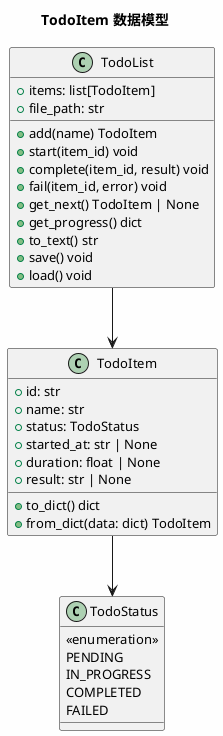
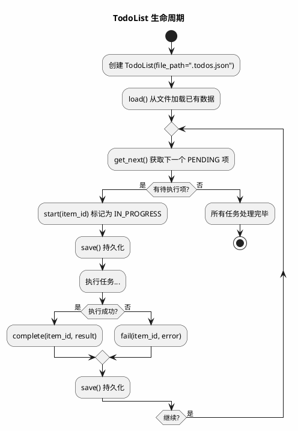

# Phase 7: TodoList 持久化任务管理

## 设计目标

实现一个轻量级、可持久化的 TodoList，作为 Agent 的任务跟踪基础设施。每个 todo 项只有 name、status、started_at、duration，数据落盘到 JSON 文件，无外部依赖。

## 为什么这样设计

### 为什么需要 TodoList？

Phase 3 的 ReAct Agent 是"边想边做"——没有全局任务视图。面对多步骤任务时，容易丢失进度、重复执行或遗漏步骤。

```
没有 TodoList:
  用户: "给项目添加日志功能"
  Agent: 执行到一半崩溃了 → 重启后从零开始，不知道之前做了什么

有 TodoList:
  用户: "给项目添加日志功能"
  Agent: 创建 5 个 todo → 执行了 3 个 → 崩溃 → 重启后读取 todo 文件 → 从第 4 个继续
```

### 为什么是 TodoList 而不是 Planning Framework？

| 维度 | 复杂 Planning 框架 | 简单 TodoList |
|------|-------------------|---------------|
| 依赖 | 需要 LLM 生成计划 | 无依赖，纯数据结构 |
| 持久化 | 通常不持久化 | 天然持久化 |
| 嵌套 | subtask、dependency | 扁平列表，简单可靠 |
| 可控性 | LLM 决定计划 | 用户/Agent 都可操作 |
| 调试 | 难以追踪 | 直接看 JSON 文件 |

**关键洞察**：Claude Code 的"规划"本质就是维护一个隐式的 todo 列表——LLM 在 system prompt 中被告知"先做什么再做什么"。我们把这个隐式列表变成显式的、持久化的数据结构。

### 各产品的任务管理方式

| 产品 | 方式 | 持久化 |
|------|------|--------|
| Claude Code | 隐式，LLM 内部推理 | 无 |
| Cursor Agent | 隐式，LLM 内部推理 | 无 |
| Devin | 显式任务列表，可视化 | 有 |
| Aider | 无任务管理 | 无 |

### 我们的设计选择

**极简 TodoList + JSON 持久化**：

1. 不做 subtask 嵌套——扁平结构简单可靠
2. 不做 dependency——顺序由列表顺序决定
3. 不做 description——name 本身就是描述，避免冗余
4. 不做 created_at——started_at 才是真正有意义的时间点
5. JSON 文件持久化——无数据库依赖，人类可读
6. duration 追踪——记录每个任务耗时，辅助性能分析

## 数据模型



## 存储格式

JSON 文件（默认 `.todos.json`）：

```json
[
  {
    "id": "a1b2c3",
    "name": "分析项目结构，了解技术栈",
    "status": "completed",
    "started_at": "2026-06-14T10:00:05",
    "duration": 27.5,
    "result": "Python 项目，使用 FastAPI + SQLAlchemy"
  },
  {
    "id": "d4e5f6",
    "name": "实现日志模块",
    "status": "in_progress",
    "started_at": "2026-06-14T10:00:33",
    "duration": null,
    "result": null
  },
  {
    "id": "g7h8i9",
    "name": "编写日志模块单元测试",
    "status": "pending",
    "started_at": null,
    "duration": null,
    "result": null
  }
]
```

## 流程图



## 目录结构

```
agent/
├── __init__.py
├── Agent.py
├── Client.py
├── data.py
├── llm/
│   ├── __init__.py
│   └── base.py
├── tools/
│   ├── __init__.py
│   ├── base.py
│   ├── registry.py
│   └── file/
│       ├── base.py
│       ├── read.py
│       ├── write.py
│       └── glob.py
└── todo/                  # TodoList 模块（新增）
    ├── __init__.py
    ├── item.py            # TodoItem 数据结构
    └── list.py            # TodoList 管理器
```

## 核心代码

### TodoItem — 待办项数据结构

```python
# agent/todo/item.py
import uuid
from dataclasses import dataclass, field
from enum import Enum


class TodoStatus(Enum):
    PENDING = "pending"
    IN_PROGRESS = "in_progress"
    COMPLETED = "completed"
    FAILED = "failed"


@dataclass
class TodoItem:
    name: str
    id: str = field(default_factory=lambda: uuid.uuid4().hex[:6])
    status: TodoStatus = TodoStatus.PENDING
    started_at: str | None = None
    duration: float | None = None
    result: str | None = None

    def to_dict(self) -> dict:
        return {
            "id": self.id,
            "name": self.name,
            "status": self.status.value,
            "started_at": self.started_at,
            "duration": self.duration,
            "result": self.result,
        }

    @classmethod
    def from_dict(cls, data: dict) -> "TodoItem":
        return cls(
            id=data["id"],
            name=data["name"],
            status=TodoStatus(data["status"]),
            started_at=data.get("started_at"),
            duration=data.get("duration"),
            result=data.get("result"),
        )
```

### TodoList — 待办列表管理器

```python
# agent/todo/list.py
import json
from datetime import datetime
from pathlib import Path

from agent.todo.item import TodoItem, TodoStatus


class TodoList:
    def __init__(self, file_path: str = ".todos.json"):
        self.items: list[TodoItem] = []
        self.file_path = Path(file_path)
        self.load()

    def add(self, name: str) -> TodoItem:
        item = TodoItem(name=name)
        self.items.append(item)
        self.save()
        return item

    def start(self, item_id: str) -> None:
        item = self._get(item_id)
        if item and item.status == TodoStatus.PENDING:
            item.status = TodoStatus.IN_PROGRESS
            item.started_at = datetime.now().isoformat()
            self.save()

    def complete(self, item_id: str, result: str = "") -> None:
        item = self._get(item_id)
        if item and item.status == TodoStatus.IN_PROGRESS:
            item.status = TodoStatus.COMPLETED
            if item.started_at:
                item.duration = (datetime.now() - datetime.fromisoformat(item.started_at)).total_seconds()
            item.result = result
            self.save()

    def fail(self, item_id: str, error: str = "") -> None:
        item = self._get(item_id)
        if item and item.status == TodoStatus.IN_PROGRESS:
            item.status = TodoStatus.FAILED
            if item.started_at:
                item.duration = (datetime.now() - datetime.fromisoformat(item.started_at)).total_seconds()
            item.result = error
            self.save()

    def get_next(self) -> TodoItem | None:
        for item in self.items:
            if item.status == TodoStatus.PENDING:
                return item
        return None

    def get_progress(self) -> dict:
        total = len(self.items)
        completed = sum(1 for i in self.items if i.status == TodoStatus.COMPLETED)
        failed = sum(1 for i in self.items if i.status == TodoStatus.FAILED)
        in_progress = sum(1 for i in self.items if i.status == TodoStatus.IN_PROGRESS)
        pending = sum(1 for i in self.items if i.status == TodoStatus.PENDING)
        return {"total": total, "completed": completed, "failed": failed, "in_progress": in_progress, "pending": pending}

    def to_text(self) -> str:
        icons = {
            TodoStatus.PENDING: "[ ]",
            TodoStatus.IN_PROGRESS: "[~]",
            TodoStatus.COMPLETED: "[x]",
            TodoStatus.FAILED: "[!]",
        }
        lines = []
        for i, item in enumerate(self.items, 1):
            icon = icons.get(item.status, "[ ]")
            line = f"  {icon} {i}. {item.name}"
            if item.duration is not None:
                line += f" ({item.duration:.1f}s)"
            lines.append(line)
        return "\n".join(lines)

    def save(self) -> None:
        data = [item.to_dict() for item in self.items]
        self.file_path.write_text(json.dumps(data, ensure_ascii=False, indent=2), encoding="utf-8")

    def load(self) -> None:
        if not self.file_path.exists():
            return
        try:
            data = json.loads(self.file_path.read_text(encoding="utf-8"))
            self.items = [TodoItem.from_dict(d) for d in data]
        except (json.JSONDecodeError, KeyError):
            self.items = []

    def clear(self) -> None:
        self.items = []
        self.save()

    def _get(self, item_id: str) -> TodoItem | None:
        for item in self.items:
            if item.id == item_id:
                return item
        return None
```

### 集成到 Agent

```python
# 在 Agent.run() 中使用 TodoList
from agent.todo.list import TodoList

class Agent:
    def __init__(self, client, system_prompt, tool_registry):
        self.client = client
        self.system_prompt = system_prompt
        self.tool_registry = tool_registry
        self.history = []
        self.todo = TodoList()

    def run(self, user_input: str):
        self.todo.load()
        # ... 原有逻辑
```

### 作为工具暴露给 LLM

```python
# agent/tools/todo_tool.py
from agent.tools.base import Tool
from agent.todo.list import TodoList


class TodoTool(Tool):
    def __init__(self, todo: TodoList):
        self.todo = todo

    @property
    def name(self) -> str:
        return "todo"

    @property
    def description(self) -> str:
        return "管理任务列表。支持 add/list/complete/fail 操作。"

    @property
    def parameters(self) -> dict:
        return {
            "type": "object",
            "properties": {
                "action": {
                    "type": "string",
                    "enum": ["add", "list", "complete", "fail"],
                    "description": "操作类型",
                },
                "name": {
                    "type": "string",
                    "description": "任务名称（add 时必填）",
                },
                "item_id": {
                    "type": "string",
                    "description": "任务 ID（complete/fail 时必填）",
                },
                "result": {
                    "type": "string",
                    "description": "执行结果（complete/fail 时可选）",
                },
            },
            "required": ["action"],
        }

    def execute(self, **kwargs) -> str:
        action = kwargs.get("action")

        if action == "add":
            name = kwargs.get("name", "")
            if not name:
                return "错误: name 是必填项"
            item = self.todo.add(name=name)
            return f"已添加任务: [{item.id}] {name}"

        elif action == "list":
            if not self.todo.items:
                return "任务列表为空"
            return self.todo.to_text()

        elif action == "complete":
            item_id = kwargs.get("item_id", "")
            result = kwargs.get("result", "")
            self.todo.complete(item_id, result)
            return f"已完成任务: {item_id}"

        elif action == "fail":
            item_id = kwargs.get("item_id", "")
            error = kwargs.get("result", "")
            self.todo.fail(item_id, error)
            return f"任务失败: {item_id}"

        else:
            return f"未知操作: {action}"
```

## 使用示例

### 直接使用 TodoList

```python
from agent.todo.list import TodoList

todo = TodoList(".todos.json")

todo.add("分析项目结构，了解技术栈")
todo.add("实现日志模块")
todo.add("编写日志模块单元测试")

print(todo.to_text())
#   [ ] 1. 分析项目结构，了解技术栈
#   [ ] 2. 实现日志模块
#   [ ] 3. 编写日志模块单元测试

next_item = todo.get_next()
todo.start(next_item.id)
# ... 执行任务 ...
todo.complete(next_item.id, "Python 项目，FastAPI + SQLAlchemy")

print(todo.to_text())
#   [x] 1. 分析项目结构，了解技术栈 (12.3s)
#   [ ] 2. 实现日志模块
#   [ ] 3. 编写日志模块单元测试
```

### 崩溃恢复

```python
# 程序重启后
todo = TodoList(".todos.json")  # 自动 load()
print(todo.to_text())
#   [x] 1. 分析项目结构，了解技术栈 (12.3s)
#   [~] 2. 实现日志模块   ← 上次崩溃时正在执行
#   [ ] 3. 编写日志模块单元测试

# 将崩溃的 IN_PROGRESS 项标记为失败，继续下一个
for item in todo.items:
    if item.status == TodoStatus.IN_PROGRESS:
        todo.fail(item.id, "程序崩溃，需要重新执行")

next_item = todo.get_next()  # 返回第 3 项
```

### LLM 通过工具操作

```
用户: 帮我规划一下添加日志功能的步骤

LLM:
  Action: todo(action="add", name="分析项目结构，了解技术栈")
  Observation: 已添加任务: [a1b2c3] 分析项目结构，了解技术栈

  Action: todo(action="add", name="实现日志模块")
  Observation: 已添加任务: [d4e5f6] 实现日志模块

  Action: todo(action="add", name="编写日志模块单元测试")
  Observation: 已添加任务: [g7h8i9] 编写日志模块单元测试

  Action: todo(action="list")
  Observation:
    [ ] 1. 分析项目结构，了解技术栈
    [ ] 2. 实现日志模块
    [ ] 3. 编写日志模块单元测试

  我已创建了 3 个任务，现在开始执行第一个...
```

## 当前方案的问题

| 问题 | 说明 |
|------|------|
| **无并发安全** | 多进程同时写 `.todos.json` 可能数据丢失 |
| **IN_PROGRESS 僵尸** | 程序崩溃后 IN_PROGRESS 项不会自动恢复 |
| **无优先级** | 任务按添加顺序执行，无法调整优先级 |

### 工业界最佳实践

1. **启动时恢复** — 程序启动时扫描 IN_PROGRESS 项，标记为 FAILED 或重新执行
2. **原子写入** — 先写临时文件再 rename，防止写入中断导致数据损坏
3. **最大条目限制** — 防止 todo 列表无限增长

## 练习题

1. **基础**：实现 `TodoItem` 和 `TodoList`，手动创建几个 todo，验证 `save/load` 持久化。

2. **进阶**：实现启动恢复——`TodoList.load()` 时，自动将 IN_PROGRESS 项标记为 FAILED，并打印警告。

3. **思考**：当前 `save()` 每次操作都写文件。如果操作频繁（如 LLM 快速连续 add 多个 todo），会有性能问题。你会如何优化？

4. **挑战**：实现原子写入——`save()` 先写入 `.todos.json.tmp`，然后用 `os.replace()` 原子替换 `.todos.json`。

## 下一阶段目标

Phase 8 将实现 **Context Engineering**——管理 Token 预算、文件上下文、对话上下文和工作记忆，让 Agent 在有限 Token 内高效工作。
