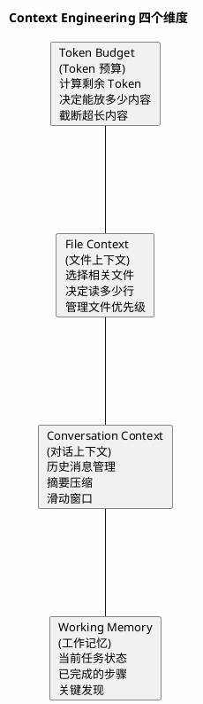
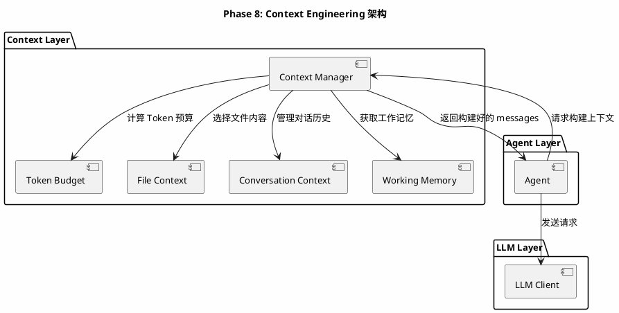
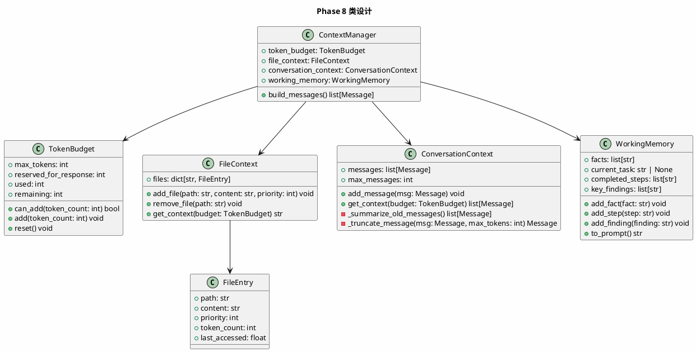
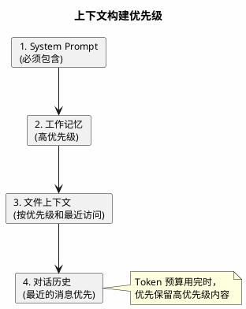

# Phase 8: Context Engineering

## 设计目标

管理 Agent 的上下文——Token 预算、文件上下文、对话上下文和工作记忆，让 Agent 在有限 Token 内高效工作。

## 为什么这样设计

### 为什么需要 Context Engineering？

LLM 有 Token 限制（GPT-4o: 128K, Claude: 200K）。Agent 运行过程中，上下文会不断增长：

```
初始: system_prompt (1K) + user_input (0.5K) = 1.5K
第1轮: + assistant_response (1K) + tool_call (0.5K) + tool_result (5K) = 8K
第2轮: + assistant_response (1K) + tool_call (0.5K) + tool_result (10K) = 19.5K
第3轮: + assistant_response (1K) + tool_call (0.5K) + tool_result (8K) = 29K
...
第10轮: 可能达到 100K+
```

**没有 Context Engineering 的 Agent**：
- 对话越长，响应越慢
- 超出 Token 限制后崩溃
- 早期重要信息被淹没

**有 Context Engineering 的 Agent**：
- 始终在 Token 预算内工作
- 保留关键信息，丢弃冗余信息
- 随着对话进行，上下文越来越精准

### Context Engineering 的四个维度



### 各产品的 Context Engineering 方案

| 产品 | Token 管理 | 文件选择 | 历史管理 | 工作记忆 |
|------|-----------|---------|---------|---------|
| Claude Code | 动态截断 | 按需读取 | 完整历史 | System Prompt |
| Cursor | 滑动窗口 | 语义搜索 | 最近 N 轮 | @引用 |
| Aider | Repo Map | 全量读取 | 完整历史 | 聊天历史 |
| Devin | 分层上下文 | 按任务选择 | 摘要压缩 | 任务状态 |

**关键洞察**：Claude Code 的核心策略是**按需读取**——不预加载所有文件，而是在需要时动态读取。这避免了上下文浪费。

### Token 计算的基础知识

```python
# 粗略估算（不同模型有不同的 tokenizer）
# 英文: ~4 字符 = 1 token
# 中文: ~1.5 字符 = 1 token
# 代码: ~3 字符 = 1 token

def estimate_tokens(text: str) -> int:
    return len(text) // 3  # 粗略估算
```

精确计算需要使用 tiktoken（OpenAI）或对应模型的 tokenizer。

## 架构图



## 类图



## 目录结构

```
src/
├── agent/
│   ├── __init__.py
│   ├── base.py
│   ├── react.py
│   └── planner.py
├── context/              # 上下文管理（新增）
│   ├── __init__.py
│   ├── manager.py        # 上下文管理器
│   ├── budget.py         # Token 预算
│   └── memory.py         # 工作记忆
├── llm/
│   ├── __init__.py
│   └── base.py
├── tools/
│   ├── ...
├── index/
│   ├── ...
└── main.py
```

## 核心代码

### TokenBudget — Token 预算

```python
# src/context/budget.py


class TokenBudget:
    def __init__(self, max_tokens: int = 128000, reserved_for_response: int = 4096):
        self.max_tokens = max_tokens
        self.reserved_for_response = reserved_for_response
        self.used = 0

    @property
    def remaining(self) -> int:
        return self.max_tokens - self.reserved_for_response - self.used

    def can_add(self, token_count: int) -> bool:
        return self.used + token_count <= self.max_tokens - self.reserved_for_response

    def add(self, token_count: int) -> None:
        self.used += token_count

    def reset(self) -> None:
        self.used = 0

    @staticmethod
    def estimate_tokens(text: str) -> int:
        return max(1, len(text) // 3)
```

### WorkingMemory — 工作记忆

```python
# src/context/memory.py
import time


class WorkingMemory:
    def __init__(self):
        self.facts: list[str] = []
        self.current_task: str | None = None
        self.completed_steps: list[str] = []
        self.key_findings: list[str] = []

    def add_fact(self, fact: str) -> None:
        if fact not in self.facts:
            self.facts.append(fact)

    def add_step(self, step: str) -> None:
        self.completed_steps.append(f"[{time.strftime('%H:%M:%S')}] {step}")

    def add_finding(self, finding: str) -> None:
        if finding not in self.key_findings:
            self.key_findings.append(finding)

    def to_prompt(self) -> str:
        parts = []

        if self.current_task:
            parts.append(f"当前任务: {self.current_task}")

        if self.key_findings:
            parts.append("关键发现:")
            for f in self.key_findings:
                parts.append(f"  - {f}")

        if self.completed_steps:
            parts.append("已完成步骤:")
            for s in self.completed_steps[-10:]:  # 最近10步
                parts.append(f"  - {s}")

        if self.facts:
            parts.append("已知事实:")
            for f in self.facts[-20:]:  # 最近20条
                parts.append(f"  - {f}")

        return "\n".join(parts)
```

### FileContext — 文件上下文

```python
# src/context/manager.py (部分)
import time
from dataclasses import dataclass, field
from context.budget import TokenBudget


@dataclass
class FileEntry:
    path: str
    content: str
    priority: int = 0
    token_count: int = 0
    last_accessed: float = field(default_factory=time.time)


class FileContext:
    def __init__(self):
        self.files: dict[str, FileEntry] = {}

    def add_file(self, path: str, content: str, priority: int = 0) -> None:
        token_count = TokenBudget.estimate_tokens(content)
        self.files[path] = FileEntry(
            path=path,
            content=content,
            priority=priority,
            token_count=token_count,
            last_accessed=time.time(),
        )

    def remove_file(self, path: str) -> None:
        self.files.pop(path, None)

    def get_context(self, budget: TokenBudget) -> str:
        sorted_files = sorted(
            self.files.values(),
            key=lambda f: (-f.priority, -f.last_accessed),
        )

        parts = []
        for entry in sorted_files:
            if not budget.can_add(entry.token_count):
                continue
            budget.add(entry.token_count)
            parts.append(f"--- {entry.path} ---\n{entry.content}")

        return "\n\n".join(parts)
```

### ConversationContext — 对话上下文

```python
from llm.base import Message


class ConversationContext:
    def __init__(self, max_messages: int = 50):
        self.messages: list[Message] = []
        self.max_messages = max_messages

    def add_message(self, msg: Message) -> None:
        self.messages.append(msg)
        if len(self.messages) > self.max_messages * 2:
            self._summarize_old_messages()

    def get_context(self, budget: TokenBudget) -> list[Message]:
        result = []
        remaining_tokens = budget.remaining

        for msg in reversed(self.messages):
            token_count = TokenBudget.estimate_tokens(msg.content or "")
            if token_count > remaining_tokens:
                continue
            remaining_tokens -= token_count
            result.insert(0, msg)

        return result

    def _summarize_old_messages(self) -> None:
        if len(self.messages) <= self.max_messages:
            return
        old = self.messages[: -self.max_messages]
        recent = self.messages[-self.max_messages :]

        summary_parts = []
        for msg in old:
            if msg.role == "user":
                summary_parts.append(f"用户: {(msg.content or '')[:100]}")
            elif msg.role == "assistant":
                summary_parts.append(f"助手: {(msg.content or '')[:100]}")

        summary = Message(
            role="system",
            content=f"[早期对话摘要]\n" + "\n".join(summary_parts),
        )
        self.messages = [summary] + recent
```

### ContextManager — 上下文管理器

```python
class ContextManager:
    def __init__(self, max_tokens: int = 128000):
        self.token_budget = TokenBudget(max_tokens=max_tokens)
        self.file_context = FileContext()
        self.conversation_context = ConversationContext()
        self.working_memory = WorkingMemory()

    def build_messages(self, system_prompt: str) -> list[Message]:
        self.token_budget.reset()

        messages = []

        # 1. 系统提示（最高优先级）
        system_content = system_prompt
        memory_prompt = self.working_memory.to_prompt()
        if memory_prompt:
            system_content += f"\n\n--- 工作记忆 ---\n{memory_prompt}"

        self.token_budget.add(TokenBudget.estimate_tokens(system_content))
        messages.append(Message(role="system", content=system_content))

        # 2. 文件上下文
        file_content = self.file_context.get_context(self.token_budget)
        if file_content:
            messages.append(Message(role="system", content=f"--- 项目文件 ---\n{file_content}"))

        # 3. 对话历史
        conv_messages = self.conversation_context.get_context(self.token_budget)
        messages.extend(conv_messages)

        return messages
```

## 上下文构建策略图



## 当前方案的问题

| 问题 | 说明 |
|------|------|
| **Token 估算粗糙** | `len(text) // 3` 不精确，不同模型差异大 |
| **无智能文件选择** | 需要手动添加文件到上下文 |
| **摘要质量低** | 简单截断，丢失语义 |
| **无动态调整** | 上下文构建后不再优化 |

### Claude Code 如何解决？

1. **动态文件读取** — 不预加载文件，按需读取
2. **大上下文窗口** — 200K tokens，大多数任务不需要压缩
3. **智能截断** — 工具结果超长时，保留头尾部分

### Cursor 如何解决？

1. **@引用机制** — 用户显式指定需要的文件
2. **语义搜索** — 自动选择最相关的代码片段
3. **滑动窗口** — 只保留最近的对话历史

### 工业界最佳实践

1. **优先级队列** — 按重要性排列上下文内容
2. **渐进加载** — 先加载摘要，需要时再加载详情
3. **Token 感知** — 每次添加内容前检查剩余预算
4. **摘要压缩** — 超出预算时，用 LLM 生成摘要替代原文

## 练习题

1. **基础**：实现 `TokenBudget`，在 Agent 循环中跟踪 Token 使用量。

2. **进阶**：实现 `WorkingMemory`，在 ReAct Agent 的每一步自动记录关键发现。

3. **思考**：当前 `ConversationContext` 的摘要只是简单截断。你会如何用 LLM 生成更好的摘要？

4. **挑战**：实现智能文件选择——当用户提出代码相关问题时，自动从索引中选择最相关的文件加入上下文。

## 下一阶段目标

Phase 9 将实现 **Claude Code 风格 Agent**——整合前面所有能力，实现自动读文件、自动修改、自动执行、自动分析错误、自动重试的完整 Coding Agent。