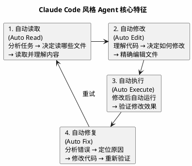
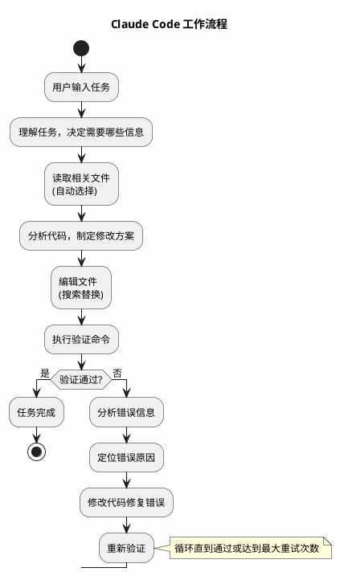
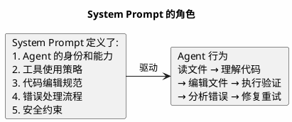
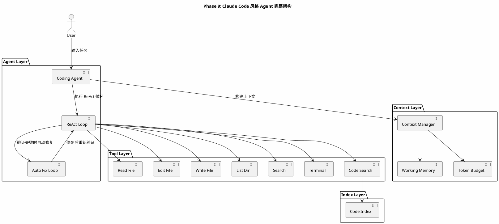
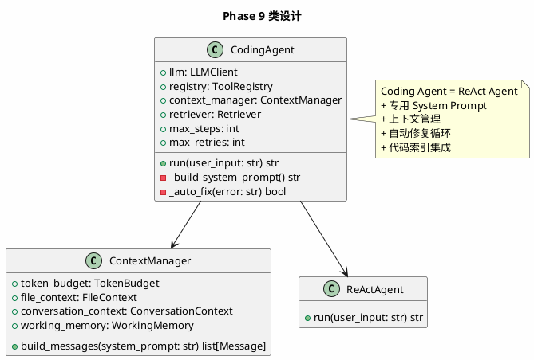

# Phase 9: Claude Code 风格 Agent

## 设计目标

整合前面所有能力，实现一个完整的 Coding Agent——自动读文件、自动修改、自动执行命令、自动分析错误、自动重试。

这是整个项目的**里程碑阶段**——从各个独立模块，组装成一个真正可用的 Coding Agent。

## 为什么这样设计

### Claude Code 风格 Agent 的核心特征



### 与之前阶段的区别

| 阶段 | 能力 | 局限 |
|------|------|------|
| Phase 1-3 | 基础 Agent Loop + Tool Calling + ReAct | 只有示例工具 |
| Phase 4-5 | 文件工具 + 终端工具 | 工具独立，无协同 |
| Phase 6 | 代码索引 | 索引与 Agent 未集成 |
| Phase 7 | Planning | 规划与执行分离 |
| Phase 8 | Context Engineering | 上下文管理独立 |
| **Phase 9** | **完整集成** | **所有能力协同工作** |

### Claude Code 的工作流程



### 核心设计：System Prompt 工程

Claude Code 风格 Agent 的关键不在代码，而在 **System Prompt**——它定义了 Agent 的行为模式。



## 架构图



## 类图



## 目录结构

```
src/
├── agent/
│   ├── __init__.py
│   ├── base.py
│   ├── react.py
│   ├── planner.py
│   └── coding.py         # Coding Agent（新增）
├── context/
│   ├── __init__.py
│   ├── manager.py
│   ├── budget.py
│   └── memory.py
├── llm/
│   ├── __init__.py
│   └── base.py
├── tools/
│   ├── __init__.py
│   ├── base.py
│   ├── file_tools.py
│   ├── terminal.py
│   └── index_tool.py
├── index/
│   ├── __init__.py
│   ├── file_tree.py
│   ├── chunker.py
│   ├── embedder.py
│   └── store.py
└── main.py
```

## 核心代码

### CodingAgent — 编程智能体

```python
# src/agent/coding.py
import json
from llm.base import LLMClient, Message
from tools.base import ToolRegistry
from tools.file_tools import ReadFile, WriteFile, EditFile, ListDir, SearchFiles, SearchContent
from tools.terminal import TerminalTool
from tools.index_tool import IndexTool
from context.manager import ContextManager
from context.memory import WorkingMemory
from index.retriever import Retriever

CODING_SYSTEM_PROMPT = """你是一个专业的编程助手（Coding Agent），能够理解代码库、编辑文件、执行命令并自动修复错误。

## 核心工作流程

1. **理解任务** — 仔细分析用户需求，明确要做什么
2. **收集信息** — 读取相关文件，理解当前代码结构
3. **制定方案** — 思考最佳实现方式
4. **编辑代码** — 使用 edit_file 或 write_file 修改代码
5. **验证结果** — 执行命令验证修改是否正确
6. **修复错误** — 如果验证失败，分析错误并修复

## 工具使用策略

### 文件操作
- **edit_file**: 修改已有文件（优先使用），确保 old_string 精确匹配
- **write_file**: 创建新文件或完全重写文件
- **read_file**: 读取文件内容，编辑前必须先读取
- **list_dir**: 查看目录结构
- **search_files**: 按文件名搜索
- **search_content**: 按内容搜索

### 终端操作
- **run_command**: 执行 shell 命令

### 代码搜索
- **search_code**: 语义搜索代码库

## 代码编辑规范

1. 编辑文件前，必须先读取文件内容
2. 使用 edit_file 时，old_string 必须与文件内容完全一致（包括缩进）
3. 每次编辑只做最小必要的修改
4. 修改后立即验证

## 错误处理

1. 如果命令执行失败，仔细阅读错误信息
2. 定位错误原因（语法错误、逻辑错误、依赖缺失等）
3. 修改代码修复错误
4. 重新验证

## 安全约束

- 不要删除重要文件
- 不要执行危险命令
- 修改前备份关键代码
"""


class CodingAgent:
    def __init__(
        self,
        llm: LLMClient,
        base_path: str = ".",
        max_steps: int = 30,
        max_retries: int = 3,
    ):
        self.llm = llm
        self.base_path = base_path
        self.max_steps = max_steps
        self.max_retries = max_retries

        self.registry = ToolRegistry()
        self._register_tools()

        self.context_manager = ContextManager()
        self.working_memory = WorkingMemory()

    def _register_tools(self) -> None:
        self.registry.register(ReadFile(self.base_path))
        self.registry.register(WriteFile(self.base_path))
        self.registry.register(EditFile(self.base_path))
        self.registry.register(ListDir(self.base_path))
        self.registry.register(SearchFiles(self.base_path))
        self.registry.register(SearchContent(self.base_path))
        self.registry.register(TerminalTool(self.base_path))

    def set_retriever(self, retriever: Retriever) -> None:
        self.registry.register(IndexTool(retriever, self.base_path))
        self.retriever = retriever

    def run(self, user_input: str) -> str:
        self.working_memory.current_task = user_input
        self.context_manager.conversation_context.add_message(
            Message(role="user", content=user_input)
        )

        for step in range(self.max_steps):
            messages = self.context_manager.build_messages(CODING_SYSTEM_PROMPT)
            tools = self.registry.get_all_schemas()
            response = self.llm.chat(messages, tools=tools if tools else None)

            if response.tool_calls:
                tc = response.tool_calls[0]

                self.context_manager.conversation_context.add_message(
                    Message(
                        role="assistant",
                        content=response.content,
                        tool_calls=[{
                            "id": tc.id,
                            "type": "function",
                            "function": {
                                "name": tc.name,
                                "arguments": json.dumps(tc.arguments),
                            },
                        }],
                    )
                )

                try:
                    result = self.registry.execute(tc.name, tc.arguments)
                except Exception as e:
                    result = f"工具执行错误: {e}"

                self.context_manager.conversation_context.add_message(
                    Message(role="tool", content=result, tool_call_id=tc.id)
                )

                self._update_memory(tc.name, tc.arguments, result)

                print(f"\n[Step {step + 1}] {tc.name}({json.dumps(tc.arguments, ensure_ascii=False)[:100]})")
                if len(result) > 200:
                    print(f"  结果: {result[:200]}...")
                else:
                    print(f"  结果: {result}")

                # 自动修复：如果终端命令失败
                if tc.name == "run_command" and "退出码: 1" in result:
                    retries = 0
                    while retries < self.max_retries:
                        print(f"\n  [自动修复 {retries + 1}/{self.max_retries}]")
                        if self._auto_fix(result):
                            break
                        retries += 1
            else:
                self.context_manager.conversation_context.add_message(
                    Message(role="assistant", content=response.content)
                )
                return response.content

        return "达到最大步数限制，未能完成任务。"

    def _auto_fix(self, error_output: str) -> bool:
        self.working_memory.add_finding(f"命令执行失败: {error_output[:200]}")

        messages = self.context_manager.build_messages(CODING_SYSTEM_PROMPT)
        messages.append(Message(
            role="user",
            content=(
                f"上一个命令执行失败，错误信息如下：\n{error_output}\n\n"
                f"请分析错误原因并修复。"
            ),
        ))

        tools = self.registry.get_all_schemas()
        response = self.llm.chat(messages, tools=tools if tools else None)

        if response.tool_calls:
            tc = response.tool_calls[0]
            try:
                result = self.registry.execute(tc.name, tc.arguments)
                self.context_manager.conversation_context.add_message(
                    Message(
                        role="assistant",
                        content=response.content,
                        tool_calls=[{
                            "id": tc.id,
                            "type": "function",
                            "function": {
                                "name": tc.name,
                                "arguments": json.dumps(tc.arguments),
                            },
                        }],
                    )
                )
                self.context_manager.conversation_context.add_message(
                    Message(role="tool", content=result, tool_call_id=tc.id)
                )
                if "退出码: 1" not in result:
                    print(f"  修复成功: {tc.name}")
                    return True
            except Exception as e:
                print(f"  修复失败: {e}")

        return False

    def _update_memory(self, tool_name: str, args: dict, result: str) -> None:
        if tool_name == "read_file":
            self.working_memory.add_step(f"读取文件: {args.get('path', '')}")
            self.context_manager.file_context.add_file(
                args.get("path", ""), result[:5000], priority=1
            )
        elif tool_name in ("edit_file", "write_file"):
            self.working_memory.add_step(f"编辑文件: {args.get('path', '')}")
        elif tool_name == "run_command":
            if "退出码: 0" in result or "退出码:" not in result:
                self.working_memory.add_step(f"执行命令: {args.get('command', '')}")
            else:
                self.working_memory.add_finding(f"命令失败: {args.get('command', '')}")
```

### main.py — 完整入口

```python
# main.py
from agent.coding import CodingAgent
from llm.base import LLMClient


def main():
    llm = LLMClient()
    agent = CodingAgent(llm=llm, base_path=".")

    print("Coding Agent v1.0 — Claude Code 风格")
    print("输入 'quit' 退出\n")

    while True:
        user_input = input("你: ").strip()
        if user_input.lower() == "quit":
            break
        if not user_input:
            continue

        response = agent.run(user_input)
        print(f"\n助手: {response}\n")


if __name__ == "__main__":
    main()
```

## 完整执行示例

用户："给 main.py 添加错误处理"

```
[Step 1] list_dir({"path": "."})
  结果: src/ main.py pyproject.toml .gitignore

[Step 2] read_file({"path": "main.py"})
  结果: 1: from agent.coding import CodingAgent
        2: from llm.base import LLMClient
        ...

[Step 3] edit_file({"path": "main.py", "old_string": "def main():", "new_string": "def main():\n    try:"})
  结果: 成功编辑文件: main.py

[Step 4] run_command({"command": "python -m py_compile main.py"})
  结果: [退出码: 0]

助手: 已为 main.py 添加错误处理，语法验证通过。
```

## 当前方案的问题

| 问题 | 说明 |
|------|------|
| **无 MCP 支持** | 无法连接外部工具服务器 |
| **单 Agent** | 复杂任务无法并行处理 |
| **无用户确认** | 文件修改直接执行，可能误操作 |
| **无 diff 预览** | 用户看不到修改内容 |
| **无持久化** | 对话结束后状态丢失 |

### Claude Code 如何解决？

1. **用户确认** — 危险操作需要用户确认
2. **流式输出** — 实时展示 Agent 的思考和操作
3. **上下文窗口** — 200K tokens，大多数任务不需要压缩
4. **工具丰富** — Read/Write/Edit/Bash/Glob/Grep

### Cursor 如何解决？

1. **Diff 预览** — 修改以 diff 形式展示
2. **内联编辑** — 直接在编辑器中展示修改
3. **用户确认** — 修改需要用户接受

### 工业界最佳实践

1. **安全第一** — 所有修改操作需要确认或可回滚
2. **可观测性** — 每一步都有日志，方便调试
3. **渐进式** — 先展示方案，再执行修改
4. **自动回滚** — 修改导致测试失败时自动回滚

## 练习题

1. **基础**：运行 Coding Agent，让它分析当前项目结构。

2. **进阶**：让 Agent 修改一个 Python 文件，添加类型注解，然后运行 mypy 验证。

3. **思考**：当前的自动修复只是简单地重新调用 LLM。你会如何改进自动修复策略？（提示：考虑错误分类、修复策略选择）

4. **挑战**：实现 diff 预览——在 edit_file 执行前，展示修改的 diff，让用户确认后才执行。

## 下一阶段目标

Phase 10 将实现 **MCP Client**——连接外部工具服务器，让 Agent 能使用 MCP 协议定义的工具。