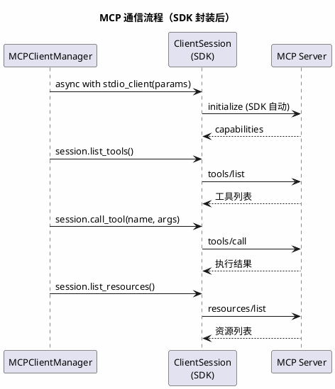
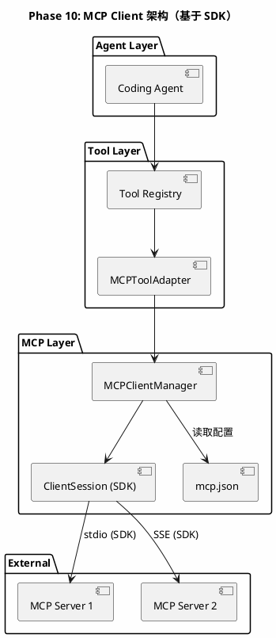
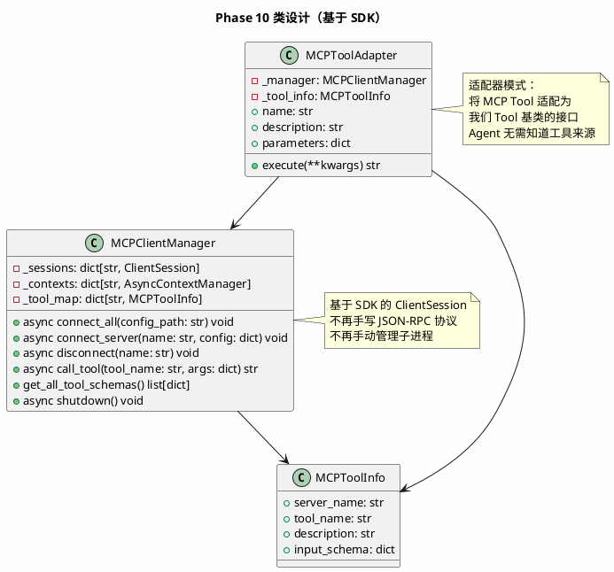

# Phase 10: MCP Client（基于 MCP SDK）

## 设计目标

基于 MCP 官方 Python SDK（`mcp` 包）实现 MCP Client，通过 `mcp.json` 配置文件驱动，让 Agent 能连接外部工具服务器。

## 为什么这样设计

### 为什么需要 MCP？

Phase 4-5 实现了内置工具（文件系统、终端），但 Agent 的能力受限于预定义的工具集。

MCP 解决了这个问题：

```
没有 MCP:
  Agent 只能用内置工具（read_file, write_file, run_command...）

有 MCP:
  Agent 可以连接任意 MCP 服务器：
  - GitHub MCP → 创建 PR、管理 Issue
  - 数据库 MCP → 查询数据库
  - Slack MCP → 发送消息
  - 自定义 MCP → 任何你想让 Agent 做的事
```

### 为什么用 SDK 而不是手写协议？

| 维度 | 手写 JSON-RPC | MCP SDK |
|------|-------------|---------|
| 代码量 | ~200 行协议层 | 0 行，SDK 内置 |
| 协议兼容性 | 需自行跟进协议版本 | SDK 自动适配 |
| 传输层 | 只能手写 stdio | SDK 内置 stdio / SSE |
| 错误处理 | 手写解析 | SDK 封装好 |
| 维护成本 | 高，协议变更需改代码 | 低，升级 SDK 即可 |
| 生命周期 | 手动管理子进程 | SDK 管理 |

**关键洞察**：手写 JSON-RPC 通信层是重复造轮子。MCP SDK 的 `ClientSession` + `StdioServerParameters` + `stdio_client` 已经完整封装了连接、初始化、工具发现、调用、关闭的全流程。

### MCP 协议核心概念

| 概念 | 说明 |
|------|------|
| **Host** | 发起连接的应用（我们的 Agent） |
| **Client** | Host 中的 MCP 客户端，与 Server 通信 |
| **Server** | 提供工具、资源、提示的服务进程 |
| **Transport** | 通信方式（stdio / SSE） |
| **Tool** | Server 提供的可调用工具 |
| **Resource** | Server 提供的可读取资源 |
| **Prompt** | Server 提供的提示模板 |

### MCP 通信流程



### 各产品的 MCP 配置方式

| 产品 | 配置文件 | 格式 |
|------|---------|------|
| Claude Code | `.claude/mcp.json` | `{ "mcpServers": { ... } }` |
| Cursor | `.cursor/mcp.json` | `{ "mcpServers": { ... } }` |
| Cline | `cline_mcp_settings.json` | `{ "mcpServers": { ... } }` |

**我们的选择**：`mcp.json`，与主流产品格式对齐。

## 架构图



## 类图



## 目录结构

```
agent/
├── __init__.py
├── Agent.py
├── Client.py
├── data.py
├── llm/
│   ├── __init__.py
│   └── base.py
├── tools/
│   ├── __init__.py
│   ├── base.py
│   ├── registry.py
│   ├── file/
│   │   ├── ...
│   ├── bash/
│   │   ├── ...
│   ├── planning/
│   │   ├── ...
│   ├── web/
│   │   ├── ...
│   └── mcp/                  # MCP 工具适配（新增）
│       ├── __init__.py
│       ├── manager.py        # MCPClientManager
│       └── adapter.py        # MCPToolAdapter
└── mcp.json                  # MCP 配置文件（新增）
```

## MCP 配置文件

配置文件 `mcp.json` 放在项目根目录，与 Claude Code / Cursor 格式对齐：

```json
{
  "mcpServers": {
    "github": {
      "command": "npx",
      "args": ["-y", "@modelcontextprotocol/server-github"],
      "env": {
        "GITHUB_TOKEN": "${GITHUB_TOKEN}"
      }
    },
    "filesystem": {
      "command": "npx",
      "args": [
        "-y",
        "@modelcontextprotocol/server-filesystem",
        "/path/to/project"
      ]
    },
    "remote-db": {
      "url": "http://localhost:3001/sse"
    }
  }
}
```

### 配置格式说明

| 字段 | 类型 | 说明 |
|------|------|------|
| `mcpServers` | object | 所有 MCP Server 配置 |
| `<name>.command` | string | stdio 模式：启动命令 |
| `<name>.args` | string[] | stdio 模式：命令参数 |
| `<name>.env` | object | stdio 模式：环境变量，`${VAR}` 自动从系统环境变量展开 |
| `<name>.url` | string | SSE 模式：远程 Server 地址 |

**传输模式判断**：有 `command` → stdio；有 `url` → SSE。无需显式声明 `transport` 字段。

## 核心代码

### MCPClientManager — MCP 客户端管理器

```python
# agent/tools/mcp/manager.py
import asyncio
import json
import os
import re
from contextlib import AsyncExitStack
from pathlib import Path

from mcp import ClientSession, StdioServerParameters
from mcp.client.stdio import stdio_client


_ENV_PATTERN = re.compile(r"\$\{(\w+)\}")


class MCPToolInfo:
    __slots__ = ("server_name", "tool_name", "description", "input_schema")

    def __init__(self, server_name: str, tool_name: str, description: str, input_schema: dict):
        self.server_name = server_name
        self.tool_name = tool_name
        self.description = description
        self.input_schema = input_schema


class MCPClientManager:
    def __init__(self, config_path: str = "mcp.json"):
        self._sessions: dict[str, ClientSession] = {}
        self._exit_stack = AsyncExitStack()
        self._tool_map: dict[str, MCPToolInfo] = {}
        self._config_path = Path(config_path)

    async def connect_all(self) -> None:
        config = self._load_config()
        for name, server_config in config.items():
            try:
                await self.connect_server(name, server_config)
            except Exception as e:
                print(f"[MCP] Failed to connect '{name}': {e}")

    async def connect_server(self, name: str, config: dict) -> None:
        if "command" in config:
            await self._connect_stdio(name, config)
        elif "url" in config:
            await self._connect_sse(name, config)
        else:
            raise ValueError(f"Server '{name}': must have 'command' or 'url'")

    async def _connect_stdio(self, name: str, config: dict) -> None:
        env = self._resolve_env(config.get("env", {}))
        params = StdioServerParameters(
            command=config["command"],
            args=config.get("args", []),
            env=env or None,
        )
        read_stream, write_stream = await self._exit_stack.enter_async_context(
            stdio_client(params)
        )
        session = await self._exit_stack.enter_async_context(
            ClientSession(read_stream, write_stream)
        )
        await session.initialize()
        self._sessions[name] = session
        await self._discover_tools(name, session)
        print(f"[MCP] Connected '{name}' (stdio)")

    async def _connect_sse(self, name: str, config: dict) -> None:
        from mcp.client.sse import sse_client

        read_stream, write_stream = await self._exit_stack.enter_async_context(
            sse_client(config["url"])
        )
        session = await self._exit_stack.enter_async_context(
            ClientSession(read_stream, write_stream)
        )
        await session.initialize()
        self._sessions[name] = session
        await self._discover_tools(name, session)
        print(f"[MCP] Connected '{name}' (sse)")

    async def _discover_tools(self, name: str, session: ClientSession) -> None:
        result = await session.list_tools()
        for tool in result.tools:
            info = MCPToolInfo(
                server_name=name,
                tool_name=tool.name,
                description=tool.description or "",
                input_schema=tool.inputSchema or {"type": "object", "properties": {}},
            )
            self._tool_map[tool.name] = info

    async def call_tool(self, tool_name: str, arguments: dict) -> str:
        info = self._tool_map.get(tool_name)
        if not info:
            return f"Error: MCP tool '{tool_name}' not found"

        session = self._sessions.get(info.server_name)
        if not session:
            return f"Error: MCP server '{info.server_name}' not connected"

        try:
            result = await session.call_tool(info.tool_name, arguments)
            return self._format_result(result)
        except Exception as e:
            return f"Error: MCP call failed: {e}"

    def get_all_tool_schemas(self) -> list[dict]:
        schemas = []
        for tool_name, info in self._tool_map.items():
            schemas.append({
                "type": "function",
                "function": {
                    "name": tool_name,
                    "description": f"[MCP:{info.server_name}] {info.description}",
                    "parameters": info.input_schema,
                },
            })
        return schemas

    def get_tool_infos(self) -> list[MCPToolInfo]:
        return list(self._tool_map.values())

    async def shutdown(self) -> None:
        await self._exit_stack.aclose()
        self._sessions.clear()
        self._tool_map.clear()

    def _load_config(self) -> dict:
        if not self._config_path.exists():
            return {}
        data = json.loads(self._config_path.read_text(encoding="utf-8"))
        return data.get("mcpServers", {})

    @staticmethod
    def _resolve_env(env: dict) -> dict:
        resolved = {}
        for key, value in env.items():
            if isinstance(value, str):
                resolved[key] = _ENV_PATTERN.sub(
                    lambda m: os.environ.get(m.group(1), ""), value
                )
            else:
                resolved[key] = str(value)
        return resolved

    @staticmethod
    def _format_result(result) -> str:
        if hasattr(result, "content") and result.content:
            texts = []
            for item in result.content:
                if hasattr(item, "text"):
                    texts.append(item.text)
                elif hasattr(item, "data"):
                    texts.append(item.data)
            return "\n".join(texts) if texts else str(result)
        return str(result)
```

### MCPToolAdapter — MCP 工具适配器

```python
# agent/tools/mcp/adapter.py
import asyncio
from agent.tools.base import Tool
from agent.tools.mcp.manager import MCPClientManager, MCPToolInfo


class MCPToolAdapter(Tool):
    def __init__(self, manager: MCPClientManager, tool_info: MCPToolInfo):
        self._manager = manager
        self._tool_info = tool_info

    @property
    def name(self) -> str:
        return self._tool_info.tool_name

    @property
    def description(self) -> str:
        return f"[MCP:{self._tool_info.server_name}] {self._tool_info.description}"

    @property
    def parameters(self) -> dict:
        return self._tool_info.input_schema

    def execute(self, **kwargs) -> str:
        try:
            loop = asyncio.get_running_loop()
        except RuntimeError:
            loop = None

        if loop and loop.is_running():
            import concurrent.futures
            with concurrent.futures.ThreadPoolExecutor() as pool:
                future = pool.submit(
                    asyncio.run,
                    self._manager.call_tool(self._tool_info.tool_name, kwargs)
                )
                return future.result(timeout=120)
        else:
            return asyncio.run(
                self._manager.call_tool(self._tool_info.tool_name, kwargs)
            )
```

### 集成到 Agent

```python
# 在 Client.py 中集成 MCP
import asyncio
from agent.tools.mcp.manager import MCPClientManager
from agent.tools.mcp.adapter import MCPToolAdapter


async def setup_mcp(tool_registry) -> MCPClientManager | None:
    manager = MCPClientManager()
    await manager.connect_all()

    if not manager.get_tool_infos():
        print("[MCP] No MCP servers configured or all connections failed")
        await manager.shutdown()
        return None

    for tool_info in manager.get_tool_infos():
        adapter = MCPToolAdapter(manager, tool_info)
        tool_registry.register(adapter)

    print(f"[MCP] {len(manager.get_tool_infos())} tools registered")
    return manager


# 在 main 中使用
if __name__ == "__main__":
    tool_registry = ToolRegistry()
    # ... 注册内置工具 ...

    mcp_manager = asyncio.run(setup_mcp(tool_registry))

    client = LLMClient()
    agent = Agent(client=client, system_prompt=SYSTEM, tool_registry=tool_registry)

    try:
        while True:
            user_input = input("User> ")
            if not user_input:
                continue
            if user_input.strip().lower() in ("exit", "quit", "q"):
                break
            res = agent.run(user_input)
            print(f"AI> {res}")
    finally:
        if mcp_manager:
            asyncio.run(mcp_manager.shutdown())
```

## 与旧方案的关键差异

| 维度 | 旧方案（手写协议） | 新方案（SDK） |
|------|-------------------|--------------|
| 协议层 | 手写 JSON-RPC + Content-Length 解析 | SDK 内置，零代码 |
| 子进程管理 | 手动 `subprocess.Popen` | SDK `stdio_client` 自动管理 |
| 传输层 | 仅 stdio | stdio + SSE，SDK 内置 |
| 初始化 | 手写 initialize + initialized 通知 | `session.initialize()` 一行 |
| 工具发现 | 手写 `tools/list` 请求 + 解析 | `session.list_tools()` 一行 |
| 工具调用 | 手写 `tools/call` 请求 + 解析 content | `session.call_tool()` 一行 |
| 资源读取 | 手写 `resources/read` + 解析 | `session.read_resource()` 一行 |
| 连接管理 | 手动 `process.terminate()` | `AsyncExitStack` 自动清理 |
| 配置方式 | 硬编码 `MCPServerConfig` | `mcp.json` 配置文件驱动 |
| 环境变量 | 不支持 `${VAR}` 展开 | 自动解析 `${VAR}` |
| 异步支持 | 无 | 全异步，基于 `asyncio` |

## 当前方案的局限性

| 问题 | 说明 | 后续优化方向 |
|------|------|------------|
| **同步/异步桥接** | Agent 是同步的，MCP SDK 是异步的，需要 `asyncio.run()` 桥接 | Agent 整体迁移到 async |
| **无重连机制** | Server 断开后不会自动重连 | 增加健康检查 + 自动重连 |
| **无超时控制** | 工具调用可能无限等待 | `call_tool` 加 `asyncio.wait_for` |
| **无工具过滤** | 所有 MCP 工具都注册 | `mcp.json` 增加 `disabledTools` 字段 |
| **工具名冲突** | 不同 Server 可能提供同名工具 | 注册时加 `server__tool` 前缀 |

### 工具名冲突的解决策略

当多个 MCP Server 提供同名工具时（如两个 Server 都有 `search`），采用 **`server__tool` 双下划线前缀**：

```python
# manager.py 中 _discover_tools 修改
def _discover_tools(self, name: str, session: ClientSession) -> None:
    result = await session.list_tools()
    for tool in result.tools:
        # 如果工具名已被占用，加 server 前缀
        final_name = tool.name
        if tool.name in self._tool_map:
            final_name = f"{name}__{tool.name}"
        info = MCPToolInfo(
            server_name=name,
            tool_name=tool.name,  # 调用时仍用原始名
            description=tool.description or "",
            input_schema=tool.inputSchema or {"type": "object", "properties": {}},
        )
        self._tool_map[final_name] = info
```

## 练习题

1. **基础**：安装 `mcp` 包，编写一个最小的 `mcp.json`，连接 `@modelcontextprotocol/server-filesystem`，验证工具发现和调用。

2. **进阶**：实现 `mcp.json` 的热重载——监听文件变更，自动断开旧连接、连接新 Server，无需重启 Agent。

3. **思考**：MCP SDK 是全异步的，而我们的 Agent 是同步的。`MCPToolAdapter.execute()` 中用 `asyncio.run()` 桥接有什么隐患？如果 Agent 本身运行在 asyncio event loop 中会怎样？

4. **挑战**：实现超时 + 重连机制——`call_tool` 设置 30s 超时，超时或连接断开时自动重连 Server 并重试。

## 下一阶段目标

Phase 11 将实现 **Multi-Agent**——Planner Agent、Executor Agent、Reviewer Agent 协作，处理更复杂的任务。
