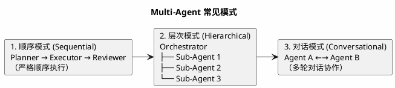
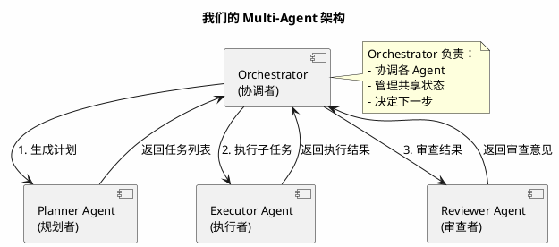
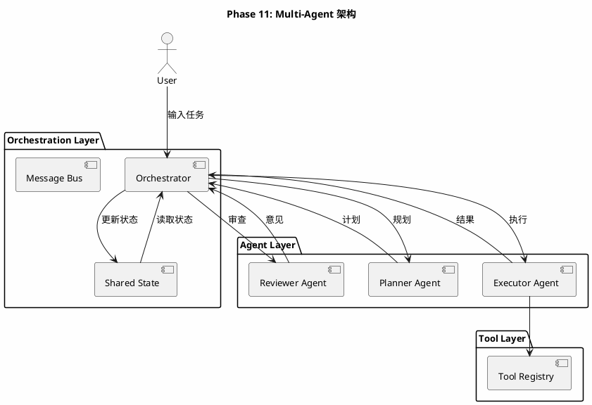
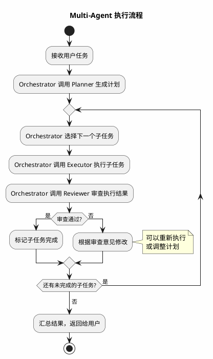
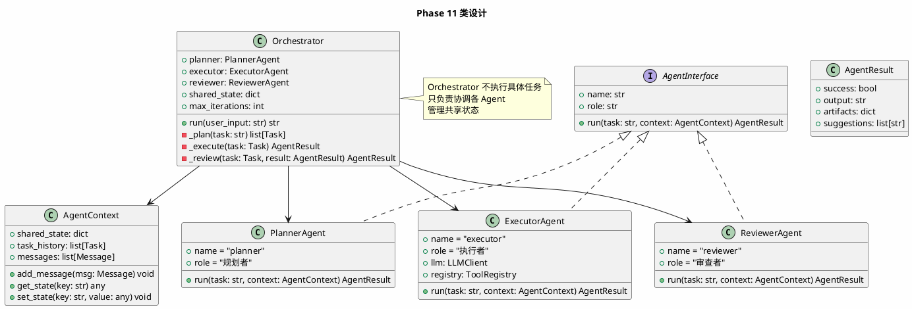
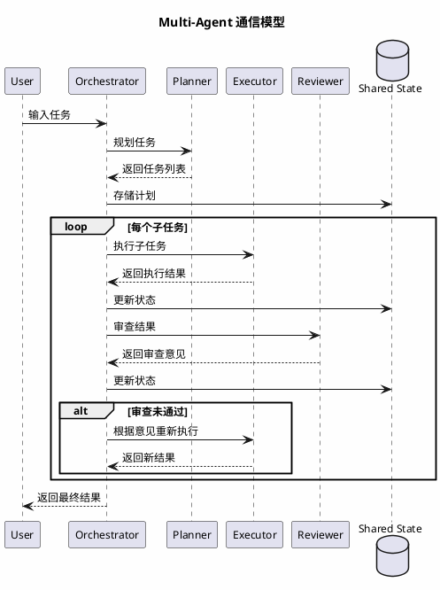

# Phase 11: Multi-Agent

## 设计目标

实现多 Agent 协作——Planner Agent、Executor Agent、Reviewer Agent 分工合作，处理更复杂的任务。

## 为什么这样设计

### 为什么需要 Multi-Agent？

单 Agent 面对复杂任务时存在瓶颈：

```
单 Agent 的问题：
1. 上下文过长 — 所有信息都在一个 Agent 的上下文中
2. 角色混淆 — 同一个 Agent 既要规划又要执行还要审查
3. 错误传播 — 规划错误导致执行错误，执行错误导致审查通过
4. 效率低下 — 串行执行所有步骤

Multi-Agent 的优势：
1. 上下文隔离 — 每个 Agent 只关注自己的任务
2. 角色专一 — 每个 Agent 有明确的职责
3. 互相校验 — Reviewer 可以发现 Executor 的错误
4. 并行执行 — 独立子任务可以并行处理
```

### Multi-Agent 的常见模式



| 模式 | 优点 | 缺点 | 适用场景 |
|------|------|------|---------|
| 顺序模式 | 简单可控 | 无法并行 | 明确的流水线任务 |
| 层次模式 | 灵活，可并行 | 实现复杂 | 大型复杂任务 |
| 对话模式 | 自然，适应性强 | 可能无限循环 | 需要协商的任务 |

### 各产品的 Multi-Agent 实现

| 产品 | 模式 | 实现 |
|------|------|------|
| Claude Code | 单 Agent | 不使用 Multi-Agent，依赖单 Agent + 大上下文 |
| Cursor | 单 Agent | 类似 Claude Code |
| MetaGPT | 层次模式 | PM → Architect → Engineer → QA |
| AutoGen | 对话模式 | 多 Agent 多轮对话 |
| CrewAI | 顺序/层次 | 角色 + 任务 + 流程 |

**关键洞察**：Claude Code 和 Cursor **不使用 Multi-Agent**！原因：
1. 大上下文窗口（200K tokens）让单 Agent 足够
2. Multi-Agent 增加了复杂度和延迟
3. 单 Agent 的 ReAct 循环已经足够灵活

**但 Multi-Agent 在以下场景有价值**：
1. 代码审查 — Reviewer Agent 发现 Executor 的错误
2. 大型项目 — 不同 Agent 负责不同模块
3. 专业分工 — 测试 Agent 专门写测试，安全 Agent 专门检查安全

### 我们的设计选择

采用**层次模式**：



## 架构图



## 流程图



## 类图



## 目录结构

```
src/
├── agent/
│   ├── __init__.py
│   ├── base.py
│   ├── react.py
│   ├── planner.py
│   ├── coding.py
│   └── multi.py          # Multi-Agent（新增）
├── context/
│   ├── ...
├── llm/
│   ├── ...
├── tools/
│   ├── ...
├── index/
│   ├── ...
├── mcp/
│   ├── ...
└── main.py
```

## 核心代码

### AgentContext — Agent 上下文

```python
# src/agent/multi.py
from dataclasses import dataclass, field
from llm.base import Message


@dataclass
class AgentResult:
    success: bool
    output: str
    artifacts: dict = field(default_factory=dict)
    suggestions: list[str] = field(default_factory=list)


class AgentContext:
    def __init__(self):
        self.shared_state: dict = {}
        self.task_history: list[dict] = []
        self.messages: list[Message] = []

    def add_message(self, msg: Message) -> None:
        self.messages.append(msg)

    def get_state(self, key: str, default=None):
        return self.shared_state.get(key, default)

    def set_state(self, key: str, value) -> None:
        self.shared_state[key] = value

    def add_task_record(self, task: str, agent: str, result: str) -> None:
        self.task_history.append({"task": task, "agent": agent, "result": result})
```

### PlannerAgent — 规划者

```python
import json
from llm.base import LLMClient, Message

PLANNER_PROMPT = """你是一个项目规划专家。你的职责是将用户需求分解为具体的执行步骤。

规则：
1. 每个步骤应该是一个明确的、可执行的任务
2. 步骤之间有逻辑顺序
3. 步骤数量适中（3-8步）
4. 返回 JSON 格式

返回格式：
```json
{
  "tasks": [
    {"description": "任务描述", "priority": "high/medium/low"}
  ]
}
```
"""


class PlannerAgent:
    def __init__(self, llm: LLMClient):
        self.llm = llm
        self.name = "planner"
        self.role = "规划者"

    def run(self, task: str, context: AgentContext) -> AgentResult:
        existing_info = ""
        if context.task_history:
            existing_info = "\n\n已完成的步骤:\n"
            for record in context.task_history[-5:]:
                existing_info += f"- {record['task']}: {record['result'][:100]}\n"

        messages = [
            Message(role="system", content=PLANNER_PROMPT),
            Message(
                role="user",
                content=f"请为以下需求制定执行计划：\n{task}{existing_info}",
            ),
        ]

        response = self.llm.chat(messages)

        try:
            json_str = response.content
            if "```json" in json_str:
                json_str = json_str.split("```json")[1].split("```")[0]
            plan_data = json.loads(json_str.strip())

            tasks = []
            for task_data in plan_data.get("tasks", []):
                tasks.append(task_data["description"])

            return AgentResult(
                success=True,
                output=f"生成了 {len(tasks)} 个子任务",
                artifacts={"tasks": tasks},
            )
        except (json.JSONDecodeError, KeyError) as e:
            return AgentResult(
                success=False,
                output=f"规划失败: {e}",
                artifacts={"tasks": [task]},
            )
```

### ExecutorAgent — 执行者

```python
from agent.coding import CodingAgent


class ExecutorAgent:
    def __init__(self, coding_agent: CodingAgent):
        self.coding_agent = coding_agent
        self.name = "executor"
        self.role = "执行者"

    def run(self, task: str, context: AgentContext) -> AgentResult:
        try:
            result = self.coding_agent.run(task)
            context.add_task_record(task, self.name, result)
            return AgentResult(
                success=True,
                output=result,
                artifacts={"execution_result": result},
            )
        except Exception as e:
            context.add_task_record(task, self.name, f"错误: {e}")
            return AgentResult(
                success=False,
                output=f"执行失败: {e}",
            )
```

### ReviewerAgent — 审查者

```python
REVIEWER_PROMPT = """你是一个代码审查专家。你的职责是审查执行结果，检查是否有问题。

审查要点：
1. 代码是否正确实现了需求
2. 是否有明显的 bug
3. 是否遵循了最佳实践
4. 是否需要进一步修改

返回格式：
```json
{
  "approved": true/false,
  "issues": ["问题1", "问题2"],
  "suggestions": ["建议1", "建议2"]
}
```
"""


class ReviewerAgent:
    def __init__(self, llm: LLMClient):
        self.llm = llm
        self.name = "reviewer"
        self.role = "审查者"

    def run(self, task: str, context: AgentContext) -> AgentResult:
        execution_result = context.get_state("last_execution_result", "")

        messages = [
            Message(role="system", content=REVIEWER_PROMPT),
            Message(
                role="user",
                content=(
                    f"任务: {task}\n\n"
                    f"执行结果:\n{execution_result[:3000]}\n\n"
                    f"请审查执行结果是否有问题。"
                ),
            ),
        ]

        response = self.llm.chat(messages)

        try:
            json_str = response.content
            if "```json" in json_str:
                json_str = json_str.split("```json")[1].split("```")[0]
            review_data = json.loads(json_str.strip())

            return AgentResult(
                success=review_data.get("approved", True),
                output="审查通过" if review_data.get("approved") else "审查未通过",
                artifacts={"review": review_data},
                suggestions=review_data.get("suggestions", []),
            )
        except (json.JSONDecodeError, KeyError):
            return AgentResult(
                success=True,
                output="审查完成（无法解析审查结果，默认通过）",
            )
```

### Orchestrator — 协调者

```python
class Orchestrator:
    def __init__(
        self,
        planner: PlannerAgent,
        executor: ExecutorAgent,
        reviewer: ReviewerAgent,
        max_iterations: int = 20,
        enable_review: bool = True,
    ):
        self.planner = planner
        self.executor = executor
        self.reviewer = reviewer
        self.max_iterations = max_iterations
        self.enable_review = enable_review

    def run(self, user_input: str) -> str:
        context = AgentContext()

        # 1. 规划
        print("\n📋 [Planner] 生成执行计划...")
        plan_result = self.planner.run(user_input, context)
        tasks = plan_result.artifacts.get("tasks", [user_input])

        print(f"   计划: {len(tasks)} 个子任务")
        for i, task in enumerate(tasks, 1):
            print(f"   {i}. {task}")

        # 2. 执行
        results = []
        for i, task in enumerate(tasks, 1):
            if i > self.max_iterations:
                print(f"\n⚠️ 达到最大迭代次数 ({self.max_iterations})")
                break

            print(f"\n🔧 [Executor] 执行子任务 {i}/{len(tasks)}: {task}")
            exec_result = self.executor.run(task, context)
            context.set_state("last_execution_result", exec_result.output)

            if not exec_result.success:
                print(f"   ❌ 执行失败: {exec_result.output[:200]}")
                results.append(f"❌ {task}: 执行失败")
                continue

            # 3. 审查
            if self.enable_review:
                print(f"   🔍 [Reviewer] 审查执行结果...")
                review_result = self.reviewer.run(task, context)

                if not review_result.success:
                    print(f"   ⚠️ 审查未通过: {review_result.output}")
                    if review_result.suggestions:
                        print(f"   建议: {', '.join(review_result.suggestions[:3])}")

                    # 根据审查意见重新执行
                        retry_task = f"{task}\n审查意见: {'; '.join(review_result.suggestions)}"
                        print(f"   🔄 根据审查意见重新执行...")
                        exec_result = self.executor.run(retry_task, context)

            results.append(f"✅ {task}: {exec_result.output[:200]}")
            print(f"   ✅ 完成")

        # 4. 汇总
        summary = f"\n📊 执行总结\n{'='*40}\n"
        for r in results:
            summary += f"{r}\n"
        return summary
```

### main.py — Multi-Agent 入口

```python
from agent.multi import Orchestrator, PlannerAgent, ExecutorAgent, ReviewerAgent
from agent.coding import CodingAgent
from llm.base import LLMClient


def main():
    llm = LLMClient()
    coding_agent = CodingAgent(llm=llm, base_path=".")

    planner = PlannerAgent(llm=llm)
    executor = ExecutorAgent(coding_agent=coding_agent)
    reviewer = ReviewerAgent(llm=llm)

    orchestrator = Orchestrator(
        planner=planner,
        executor=executor,
        reviewer=reviewer,
        enable_review=True,
    )

    print("Coding Agent v2.0 — Multi-Agent 模式")
    print("输入 'quit' 退出\n")

    while True:
        user_input = input("你: ").strip()
        if user_input.lower() == "quit":
            break
        if not user_input:
            continue

        result = orchestrator.run(user_input)
        print(result)


if __name__ == "__main__":
    main()
```

## Multi-Agent 通信模型



## 当前方案的问题

| 问题 | 说明 |
|------|------|
| **串行执行** | 子任务之间是串行的，无法并行 |
| **审查质量** | Reviewer 可能审查不严格或过度审查 |
| **上下文丢失** | Agent 之间通过 Shared State 传递信息，可能丢失细节 |
| **无动态调整** | 计划生成后不能根据执行情况动态调整 |
| **成本高** | 多个 Agent 各自调用 LLM，Token 消耗成倍增加 |

### Claude Code 为什么不用 Multi-Agent？

1. **大上下文窗口** — 200K tokens 足以处理大多数任务
2. **简单性** — 单 Agent 更容易调试和预测
3. **延迟** — Multi-Agent 增加了额外的 LLM 调用
4. **成本** — 多 Agent 意味着更多 Token 消耗

### 什么时候需要 Multi-Agent？

1. **代码审查** — 独立的 Reviewer 比自我审查更可靠
2. **大型项目** — 不同模块由不同 Agent 负责
3. **安全关键** — 需要多重检查的场景
4. **并行任务** — 独立的子任务可以并行处理

### 工业界最佳实践

1. **按需使用** — 简单任务用单 Agent，复杂任务才用 Multi-Agent
2. **共享上下文** — Agent 之间通过结构化状态传递信息
3. **角色明确** — 每个 Agent 有清晰的职责边界
4. **成本控制** — 监控每个 Agent 的 Token 消耗

## 练习题

1. **基础**：运行 Multi-Agent，给它一个需要多步骤的任务，观察各 Agent 的协作过程。

2. **进阶**：实现动态调整——当 Executor 执行失败时，Orchestrator 自动调用 Planner 重新规划。

3. **思考**：当前的 Shared State 是一个简单的 dict。如果多个 Agent 同时写入同一个 key，会发生什么？你会如何设计来避免冲突？

4. **挑战**：实现并行执行——使用 `asyncio` 让多个 Executor 并行处理独立的子任务。

## 总结

恭喜你完成了整个 Coding Agent 的构建旅程！回顾一下：

| Phase | 核心能力 | 关键洞察 |
|-------|---------|---------|
| 1 | Agent Loop | Agent 本质是 while 循环 |
| 2 | Tool Calling | 让 LLM 从"说话"到"做事" |
| 3 | ReAct | Thought → Action → Observation |
| 4 | 文件工具 | Agent 的"眼睛和手" |
| 5 | 终端工具 | Agent 的"执行力" |
| 6 | 代码索引 | 从"翻阅"到"检索" |
| 7 | Planning | 从"边想边做"到"先规划再执行" |
| 8 | Context Engineering | 在有限 Token 内高效工作 |
| 9 | Claude Code 风格 | 完整的 Coding Agent |
| 10 | MCP Client | 连接外部工具生态 |
| 11 | Multi-Agent | 分工协作，处理复杂任务 |

**下一步方向**：
- 添加 Web UI（如 Gradio、Streamlit）
- 实现流式输出（SSE / WebSocket）
- 添加用户认证和权限管理
- 支持更多 LLM 提供商
- 实现插件系统
- 添加持久化存储