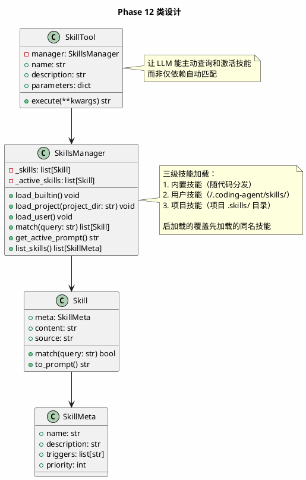
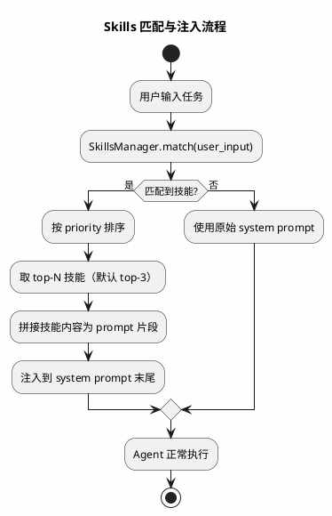

# Phase 12: Skills 技能系统

## 设计目标

实现 Skills 技能系统——将领域专有知识（prompt + 工作流 + 示例）封装为可插拔的"技能"，按需注入 Agent 的 system prompt，让 Agent 在不同场景下表现出专业能力。

## 为什么这样设计

### 为什么需要 Skills？

Phase 9 的 Coding Agent 用一个固定的 system prompt 定义了所有行为。但不同任务需要不同的专业知识和工作流：

```
没有 Skills:
  用户: "帮我写一个 React 组件"
  Agent: 用通用方式写代码，可能不符合 React 最佳实践

  用户: "帮我排查这个内存泄漏"
  Agent: 用通用方式调试，可能遗漏关键检查点

有 Skills:
  用户: "帮我写一个 React 组件"
  Agent: 加载 frontend 技能 → 遵循组件设计规范 → 产出高质量代码

  用户: "帮我排查这个内存泄漏"
  Agent: 加载 debugging 技能 → 按排查清单逐步定位 → 高效找到根因
```

### Skills vs System Prompt vs Tool

| 维度 | System Prompt | Tool | Skill |
|------|-------------|------|-------|
| 本质 | 全局行为指令 | 可调用的函数 | 领域知识包 |
| 作用时机 | 始终生效 | LLM 主动调用 | 按需注入 |
| 内容 | 行为规范 | 代码逻辑 | prompt + 工作流 + 示例 |
| Token 开销 | 固定 | 仅 schema | 激活时才消耗 |
| 扩展方式 | 改代码 | 写新 Tool 类 | 写 SKILL.md 文件 |

**关键洞察**：Skill 不是 Tool——Tool 是"手"，让 Agent 能做事；Skill 是"脑"，让 Agent 知道怎么做。Skill 的本质是**结构化的 prompt 片段**，在 Agent 遇到匹配场景时动态注入。

### 各产品的 Skills 实现

| 产品 | 实现方式 | 格式 |
|------|---------|------|
| Claude Code | CLAUDE.md 项目指令 | Markdown，放在项目根目录 |
| Cursor | `.cursor/rules/` | Markdown，按模式匹配 |
| Windsurf | `.windsurfrules` | Markdown，全局规则 |
| Cline | `.clinerules` | Markdown，项目规则 |

**我们的选择**：`SKILL.md` + 目录结构，兼顾可读性和结构化。

### 核心设计决策

1. **Skill 是 prompt 片段，不是代码** — 不需要写 Python 类，只需要写 Markdown
2. **按需激活，不常驻** — 只在匹配时注入，节省 Token
3. **目录即技能** — 一个目录 = 一个技能，`SKILL.md` 是入口
4. **用户可扩展** — 用户在项目中创建 `.skills/` 目录即可添加自定义技能

## 架构图

```plantuml
@startuml
skinparam backgroundColor #FEFEFE
skinparam defaultFontSize 13
skinparam componentStyle uml2

title Phase 12: Skills 技能系统架构

actor User as user

package "Agent Layer" {
    component "Agent" as agent
}

package "Skill Layer" {
    component "SkillsManager" as manager
    component "SkillMatcher" as matcher
    component "SkillInjector" as injector
}

package "Skill Store" {
    component "Built-in Skills\n(.skills/)" as builtin
    component "Project Skills\n(project/.skills/)" as project
    component "User Skills\n(~/.coding-agent/skills/)" as user
}

user --> agent : 输入任务
agent --> manager : 请求匹配技能
manager --> matcher : 匹配
manager --> injector : 注入
matcher --> builtin
matcher --> project
matcher --> user
injector --> agent : 追加到 system prompt

@enduml
```

## Skill 目录结构

```
.skills/                          # 项目级技能目录（新增）
├── frontend/
│   └── SKILL.md                  # 前端开发技能
├── debugging/
│   └── SKILL.md                  # 调试技能
├── testing/
│   └── SKILL.md                  # 测试技能
├── api-design/
│   └── SKILL.md                  # API 设计技能
└── security/
    └── SKILL.md                  # 安全审计技能

~/.coding-agent/skills/           # 用户全局技能目录
├── my-workflow/
│   └── SKILL.md
└── ...

# 内置技能（随代码分发）
agent/tools/skills/builtin/
├── code-review/
│   └── SKILL.md
├── refactoring/
│   └── SKILL.md
└── git-workflow/
    └── SKILL.md
```

## SKILL.md 格式

每个技能由一个 `SKILL.md` 文件定义，包含元信息、触发条件、知识内容三部分：

```markdown
---
name: frontend
description: 前端开发最佳实践，支持 React/Vue 组件开发
triggers:
  - react
  - vue
  - component
  - frontend
  - css
  - 样式
  - 组件
priority: 10
---

# 前端开发技能

## 组件开发规范

1. 组件文件使用 PascalCase 命名
2. 每个组件文件只导出一个组件
3. Props 使用 TypeScript 接口定义
4. 状态管理遵循单向数据流

## 工作流

1. 分析 UI 需求，拆解为组件树
2. 从叶子组件开始实现
3. 每个组件先写 Props 类型，再写逻辑，最后写样式
4. 使用 Storybook 验证组件

## 示例

### React 组件模板

\```tsx
interface ButtonProps {
  variant?: 'primary' | 'secondary';
  children: React.ReactNode;
  onClick?: () => void;
}

export function Button({ variant = 'primary', children, onClick }: ButtonProps) {
  return <button className={`btn btn-${variant}`} onClick={onClick}>{children}</button>;
}
\```
```

### 元信息字段说明

| 字段 | 类型 | 必填 | 说明 |
|------|------|------|------|
| `name` | string | 是 | 技能唯一标识 |
| `description` | string | 是 | 技能描述，用于 LLM 理解 |
| `triggers` | string[] | 是 | 触发关键词，匹配用户输入时激活 |
| `priority` | int | 否 | 优先级，数字越大越优先，默认 0 |

## 类图



## 流程图



## 核心代码

### Skill — 技能数据结构

```python
# agent/tools/skills/data.py
from dataclasses import dataclass, field


@dataclass
class SkillMeta:
    name: str
    description: str
    triggers: list[str] = field(default_factory=list)
    priority: int = 0


@dataclass
class Skill:
    meta: SkillMeta
    content: str
    source: str = ""

    def match(self, query: str) -> bool:
        q = query.lower()
        return any(t.lower() in q for t in self.meta.triggers)

    def to_prompt(self) -> str:
        return f"\n## 技能: {self.meta.name}\n\n{self.content}\n"
```

### SkillsManager — 技能管理器

```python
# agent/tools/skills/manager.py
import re
from pathlib import Path

from agent.tools.skills.data import Skill, SkillMeta


class SkillsManager:
    BUILTIN_DIR = Path(__file__).parent / "builtin"
    USER_DIR = Path.home() / ".coding-agent" / "skills"

    def __init__(self, max_active: int = 3):
        self._skills: list[Skill] = []
        self._active_skills: list[Skill] = []
        self.max_active = max_active

    def load_all(self, project_dir: str | None = None) -> None:
        self._skills.clear()
        self._load_from_dir(self.BUILTIN_DIR, source="builtin")
        self._load_from_dir(self.USER_DIR, source="user")
        if project_dir:
            self._load_from_dir(Path(project_dir) / ".skills", source="project")

    def match(self, query: str) -> list[Skill]:
        matched = [s for s in self._skills if s.match(query)]
        matched.sort(key=lambda s: s.meta.priority, reverse=True)
        return matched[:self.max_active]

    def activate(self, query: str) -> str:
        self._active_skills = self.match(query)
        if not self._active_skills:
            return ""
        parts = [s.to_prompt() for s in self._active_skills]
        names = ", ".join(s.meta.name for s in self._active_skills)
        print(f"[Skills] Activated: {names}")
        return "".join(parts)

    def get_active_prompt(self) -> str:
        if not self._active_skills:
            return ""
        return "".join(s.to_prompt() for s in self._active_skills)

    def list_skills(self) -> list[SkillMeta]:
        return [s.meta for s in self._skills]

    def get_skill(self, name: str) -> Skill | None:
        for s in self._skills:
            if s.meta.name == name:
                return s
        return None

    def _load_from_dir(self, skills_dir: Path, source: str) -> None:
        if not skills_dir.exists():
            return
        for skill_file in skills_dir.glob("*/SKILL.md"):
            skill = self._parse_skill(skill_file, source)
            if skill:
                existing = self.get_skill(skill.meta.name)
                if existing:
                    idx = self._skills.index(existing)
                    self._skills[idx] = skill
                else:
                    self._skills.append(skill)

    def _parse_skill(self, path: Path, source: str) -> Skill | None:
        text = path.read_text(encoding="utf-8")
        meta, content = self._split_frontmatter(text)
        if not meta.get("name"):
            return None
        return Skill(
            meta=SkillMeta(
                name=meta["name"],
                description=meta.get("description", ""),
                triggers=meta.get("triggers", []),
                priority=int(meta.get("priority", 0)),
            ),
            content=content.strip(),
            source=source,
        )

    @staticmethod
    def _split_frontmatter(text: str) -> tuple[dict, str]:
        if not text.startswith("---"):
            return {}, text
        parts = text.split("---", 2)
        if len(parts) < 3:
            return {}, text
        meta = {}
        for line in parts[1].strip().split("\n"):
            if ":" in line:
                key, _, value = line.partition(":")
                key = key.strip()
                value = value.strip()
                if key == "triggers":
                    items = re.findall(r"['\"]([^'\"]+)['\"]", value)
                    meta[key] = items
                else:
                    meta[key] = value
        return meta, parts[2]
```

### SkillTool — 技能查询工具

```python
# agent/tools/skills/tool.py
from agent.tools.base import Tool
from agent.tools.skills.manager import SkillsManager


class SkillTool(Tool):
    def __init__(self, manager: SkillsManager):
        self.manager = manager

    @property
    def name(self) -> str:
        return "skills"

    @property
    def description(self) -> str:
        return "查看可用技能列表，或激活指定技能。技能包含特定领域的专业知识和工作流。"

    @property
    def parameters(self) -> dict:
        return {
            "type": "object",
            "properties": {
                "action": {
                    "type": "string",
                    "enum": ["list", "activate"],
                    "description": "list: 查看所有可用技能；activate: 激活指定技能",
                },
                "name": {
                    "type": "string",
                    "description": "要激活的技能名称（activate 时必填）",
                },
            },
            "required": ["action"],
        }

    def execute(self, **kwargs) -> str:
        action = kwargs.get("action")

        if action == "list":
            skills = self.manager.list_skills()
            if not skills:
                return "No skills available"
            lines = []
            for s in skills:
                triggers = ", ".join(s.triggers[:5])
                lines.append(f"- {s.name}: {s.description} (triggers: {triggers})")
            return "Available skills:\n" + "\n".join(lines)

        elif action == "activate":
            name = kwargs.get("name", "")
            if not name:
                return "Error: name is required for activate"
            skill = self.manager.get_skill(name)
            if not skill:
                return f"Error: skill '{name}' not found"
            self.manager._active_skills = [skill]
            return f"Skill '{name}' activated. Its knowledge will guide your next actions."

        return f"Error: unknown action '{action}'"
```

### 集成到 Agent

```python
# 修改 Agent.py，在构建 prompt 时注入技能
from agent.tools.skills.manager import SkillsManager


class Agent:
    def __init__(self, client, system_prompt, tool_registry, skills_manager=None):
        self.client = client
        self.system_prompt = system_prompt
        self.tool_registry = tool_registry
        self.skills_manager = skills_manager
        self.history = []

    def run(self, user_input: str):
        self.history.append(Message(role="user", content=user_input))

        # 首轮自动匹配技能
        skill_prompt = ""
        if self.skills_manager and len(self.history) <= 1:
            skill_prompt = self.skills_manager.activate(user_input)

        while True:
            messages = []
            system = self.system_prompt + skill_prompt
            if self.skills_manager:
                system += self.skills_manager.get_active_prompt()
            if system:
                messages.append(Message(role="system", content=system))
            messages.extend(self.history)

            chat_response = self.client.chat(
                msgs=messages, tools=self.tool_registry.get_all_tools()
            )
            # ... 后续逻辑不变
```

### 集成到 Client.py

```python
# 修改 Client.py
from agent.tools.skills.manager import SkillsManager
from agent.tools.skills.tool import SkillTool

if __name__ == "__main__":
    tool_registry = ToolRegistry()
    # ... 注册内置工具 ...

    # Skills
    skills_manager = SkillsManager(max_active=3)
    skills_manager.load_all(project_dir=WORK_DIR)
    tool_registry.register(SkillTool(skills_manager))

    client = LLMClient()
    agent = Agent(
        client=client,
        system_prompt=SYSTEM,
        tool_registry=tool_registry,
        skills_manager=skills_manager,
    )
    # ... 主循环不变
```

## 内置技能示例

### code-review/SKILL.md

```markdown
---
name: code-review
description: 代码审查技能，提供系统化的代码审查流程和检查清单
triggers:
  - review
  - 审查
  - code review
  - 代码质量
  - 重构
priority: 5
---

# 代码审查技能

## 审查流程

1. **理解意图** — 先理解代码要做什么，再审查怎么做的
2. **分层审查** — 架构 → 逻辑 → 边界 → 风格
3. **给出建议** — 每个问题附带修改建议

## 检查清单

### 架构层
- [ ] 职责是否单一？
- [ ] 依赖是否合理？
- [ ] 接口是否清晰？

### 逻辑层
- [ ] 边界条件是否处理？
- [ ] 错误路径是否覆盖？
- [ ] 并发是否安全？

### 风格层
- [ ] 命名是否语义化？
- [ ] 是否有重复代码？
- [ ] 注释是否有价值？

## 输出格式

对每个问题：
1. **位置**：文件:行号
2. **严重度**：🔴 必须修复 / 🟡 建议修复 / 🟢 可选优化
3. **问题**：一句话描述
4. **建议**：修改方案或代码示例
```

### debugging/SKILL.md

```markdown
---
name: debugging
description: 调试技能，提供系统化的问题排查流程
triggers:
  - debug
  - 调试
  - 报错
  - 错误
  - bug
  - 崩溃
  - 异常
  - error
  - crash
  - exception
priority: 10
---

# 调试技能

## 排查流程

1. **复现** — 确认能稳定复现问题
2. **定位** — 从错误信息/堆栈找到相关代码
3. **假设** — 列出可能的原因（最多 3 个）
4. **验证** — 逐个验证假设，排除不可能的
5. **修复** — 针对根因修复，而非症状

## 常见错误模式

| 类型 | 特征 | 排查方向 |
|------|------|---------|
| TypeError | None.xxx / str + int | 检查变量类型和来源 |
| KeyError | dict[key] | 检查 key 是否存在 |
| ImportError | No module | 检查依赖和 PYTHONPATH |
| 死循环 | CPU 100% | 检查循环条件和退出 |
| 内存泄漏 | 内存持续增长 | 检查缓存和引用 |

## 工具使用策略

- 先 `read_file` 读报错文件
- 用 `grep` 搜索相关调用
- 用 `run_command` 运行最小复现代码
- 修复后运行测试验证
```

## 与其他系统的对比

### vs Cursor Rules

Cursor 的 `.cursor/rules/` 支持文件模式匹配（`*.tsx` → 加载 React 规则），我们的 Skills 用关键词触发，更简单但更灵活：

| 维度 | Cursor Rules | Skills |
|------|-------------|--------|
| 触发方式 | 文件模式匹配 | 关键词 + LLM 主动激活 |
| 格式 | 纯 Markdown | Markdown + YAML frontmatter |
| 作用范围 | 编辑器内 | Agent 全生命周期 |
| 可组合性 | 多规则可叠加 | 多技能可叠加 |

### vs Claude Code CLAUDE.md

Claude Code 的 `CLAUDE.md` 是项目级全局指令，始终生效：

| 维度 | CLAUDE.md | Skills |
|------|-----------|--------|
| 作用范围 | 全局，始终生效 | 按需激活 |
| Token 开销 | 固定消耗 | 激活时才消耗 |
| 扩展性 | 单文件 | 多目录多文件 |
| 适用场景 | 项目约定 | 领域专有知识 |

**两者互补**：`CLAUDE.md` 放项目约定（如"本项目使用 Python 3.11 + FastAPI"），Skills 放领域知识（如"如何写 React 组件"）。

## 当前方案的局限性

| 问题 | 说明 | 后续优化方向 |
|------|------|------------|
| **关键词匹配粗糙** | 简单的 `in` 匹配，可能误触发 | 用 embedding 做语义匹配 |
| **无技能冲突处理** | 多个技能可能给出矛盾建议 | 按优先级排序 + 冲突检测 |
| **无技能版本管理** | 同名技能直接覆盖 | 支持版本号 + 兼容性检查 |
| **技能内容可能过长** | 复杂技能消耗大量 Token | 按章节懒加载，只注入相关章节 |
| **无技能市场** | 用户无法方便地分享技能 | 支持从 Git 仓库安装技能 |

### 工业界最佳实践

1. **最小注入** — 只注入与当前任务相关的技能片段，而非全部内容
2. **分层优先** — 内置 < 用户 < 项目，后加载的覆盖先加载的
3. **可观测** — 打印激活了哪些技能，方便调试
4. **可关闭** — 用户可以禁用特定技能或关闭自动匹配

## 练习题

1. **基础**：创建一个 `.skills/python-style/SKILL.md`，定义 Python 代码风格技能，让 Agent 在写 Python 代码时遵循你的团队规范。

2. **进阶**：实现语义匹配——用 embedding 计算用户输入与技能描述的相似度，替代关键词匹配。

3. **思考**：Skill 的内容是纯文本（Markdown），如果技能需要"执行动作"（如自动安装依赖），应该怎么设计？Skill 和 Tool 的边界在哪里？

4. **挑战**：实现技能懒加载——SKILL.md 支持分章节，匹配时只注入相关章节而非全部内容。

## 下一阶段目标

Phase 13 将实现 **Hook 钩子系统**——在工具执行前后插入自定义逻辑（权限校验、日志审计、自动回滚），让 Agent 的行为更安全可控。